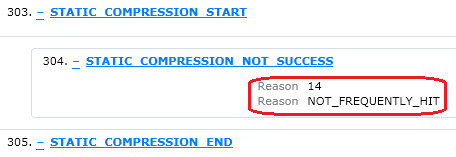

Troubleshooting IIS Compression issues in IIS6/IIS7.x
====================
by Shoeb Ilyas Bhaldar and Mike Laing

#### Tools Used in this Troubleshooter:

- Fiddler
- Network Monitor
- Process Monitor
- Metabase ACL
- IIS 6 ETW trace
- IIS 7 FREB trace

This material is provided for informational purposes only. Microsoft makes no warranties, express or implied.

## Overview

Enabling HTTP Compression for your IIS6/7 web applications is one way of increasing site performance.

Unfortunately IIS admin GUI doesn't expose many of the compression properties needed to fully administer it. In it only lets us turn it on or off. So it is important to note that to configure http compression to its full extent you'll need to edit the metabase.xml using a tool other than the IIS Manager. The most common tool we use is adsutil.vbs, which is included in the IIS installation

This troubleshooter will help you to configure compression &amp; identify common reasons why IIS compression may not work in IIS6 and IIS 7.x

## Verification

**Determining if compression is working**

The only way of determining whether the IIS server sent a compressed response is by analyzing a network trace of the client request/server response. The request from the client needs to contain the following HTTP Request Header:

[!code-console[Main](troubleshooting-iis-compression-issues-in-iis6-iis7x/samples/sample1.cmd)]

This tells the server that the client supports compression and will accept a compressed response. In return, a compressed response from the server will contain the following HTTP Response header and a value:

[!code-console[Main](troubleshooting-iis-compression-issues-in-iis6-iis7x/samples/sample2.cmd)]

Fiddler output when compression is not working:

## Troubleshooting

1. **Enable Compression in IIS6/IIS7:** From the IIS Manager, right-click on the Web Sites node, Properties and click on Services.

    

    
2. **Compression folder and permissions on it:** IIS stores compressed files in a folder which can be configured. By default, it is `%windir%\IIS Temporary Compressed Files` for IIS 6, and `%SystemDrive%\inetpub\temp\IIS Temporary Compressed Files` for IIS 7.

    IIS\_WPG(IIS\_IURS for IIS 7) must have full control permission for this folder. Process Monitor is a great tool to troubleshooting this type of permission issue.

    [Process Monitor](https://technet.microsoft.com/sysinternals/bb896645)
3. **Check if compression is enabled in Metabase.xml:** Compression is not turned on in the metabase at the right locations. There are three metabase locations for Compression configuration:

    [!code-console[Main](troubleshooting-iis-compression-issues-in-iis6-iis7x/samples/sample3.cmd)]

    [!code-console[Main](troubleshooting-iis-compression-issues-in-iis6-iis7x/samples/sample4.cmd)]

    [!code-console[Main](troubleshooting-iis-compression-issues-in-iis6-iis7x/samples/sample5.cmd)]

    Configuring at the /parameters location is \*mandatory\*. Then, you need to configure at either /gzip \*or\* /deflate, \*or\* both. This means that configuring at just /gzip will not work, at just /deflate will not work, and just /parameters will not work. But, configuring at /parameters and /gzip will enable the Gzip compression scheme. And, configuring /parameters and /deflate will enable the Deflate compression scheme. Finally, configuring at all three will enable both GZip compression and Deflate compression.
4. **Check the metabase permission for IIS 6:** By default, IIS\_WPG has Read, Unsecure Read, Enumerate Keys and Write permission to the /LM/W3SVC/Filters.

    IIS is unable to initialize the compression if the permissions were removed due to unexpected change or security hardens.

    [Using metaacl.vbs to verify and modify IIS 6 metabase ACL.](https://www.microsoft.com/download/en/details.aspx?displaylang=en&amp;id=4899)

    [Default Metabase ACL](https://msdn.microsoft.com/library/ms524775(v=VS.90).aspx)

    If the application pool identity (or the IIS\_WPG group in general) does not have Read and Write access to the metabase key W3SVC/Filters a failure condition of COMPRESSION\_DISABLED will be logged in an Enterprise Tracing for Windows (ETW) trace.

    ETW Trace:

    [!code-console[Main](troubleshooting-iis-compression-issues-in-iis6-iis7x/samples/sample6.cmd)]
5. **Check if Dynamic or Static compression is turned off in Metabase.xml:** At each of the three configuration locations (/parameters, /gzip, and /deflate), you have the option of enabling Static and/or Dynamic compression. For static files like txt and html to be compressed, you need to set the HcDoStaticCompression key to 1 (or TRUE). To enable Dynamic compression (for things like asp, aspx, asmx, exe) you need to have HcDoDynamicCompression set to 1 (or TRUE).

    For example, to set dynamic compression at the /parameters node using adsutil.vbs, run this command:

    [!code-console[Main](troubleshooting-iis-compression-issues-in-iis6-iis7x/samples/sample7.cmd)]

    The output to that command looks like this:

    [!code-console[Main](troubleshooting-iis-compression-issues-in-iis6-iis7x/samples/sample8.cmd)]

    **In IIS7:** 

    [!code-xml[Main](troubleshooting-iis-compression-issues-in-iis6-iis7x/samples/sample9.xml)]
6. **Check if file type you want to compress is listed in the appropriate File Extensions sections at the /gzip and /deflate nodes:** Once you turn on compression with the HcDoDynamicCompression and/or HcDoStaticCompression keys, you have to make sure to tell IIS which file types to actually compress. By default, we compress htm, html, and txt for STATIC compression, and asp, dll, and exe for DYNAMIC compression. If you want different file types compressed, for example aspx, you need to add it to the appropriate file extension section in the /gzip and-or /deflate nodes, depending on the type of compression you're using. For static file compression (like html, txt, and xml), you add the file extensions to the HcFileExtensions property. For dynamic compression (like asp, aspx, asmx) you add it to the HcScriptFileExtension property.

    **For static files:** 

    [!code-console[Main](troubleshooting-iis-compression-issues-in-iis6-iis7x/samples/sample10.cmd)]

    [!code-console[Main](troubleshooting-iis-compression-issues-in-iis6-iis7x/samples/sample11.cmd)]

    This command will output:

    [!code-console[Main](troubleshooting-iis-compression-issues-in-iis6-iis7x/samples/sample12.cmd)]

    **For dynamic files:** 

    [!code-console[Main](troubleshooting-iis-compression-issues-in-iis6-iis7x/samples/sample13.cmd)]

    This command will output:

    [!code-console[Main](troubleshooting-iis-compression-issues-in-iis6-iis7x/samples/sample14.cmd)]

    **IN IIS7:** 

    [!code-xml[Main](troubleshooting-iis-compression-issues-in-iis6-iis7x/samples/sample15.xml)]

    > [!NOTE]
    > Configuring the HcFileExtensions or HcScriptFileExtensions properties needs to be done with the exact right syntax. Any trailing spaces or unnecessary quotes/carriage returns will cause the property to be misconfigured. Unfortunately adsutil.vbs does not throw an error if you add an extra space, so you need to be very careful. Also, copy/pasting the values into a command prompt or into the metabase.xml file (metabase direct-edit) is a bad idea....always type it manually!
7. **Check if compression is set at the master level, but is getting overridden by a setting at a child level:** Compression would be enabled at the w3svc/filters/compression level, however if may be possible that it's getting overridden by a setting at the web site/application level.

    **For eg:** If you have HcDoDynamicCompression set to TRUE at w3svc/filters/compression level, and for the default web site have DoDynamicCompression set to FALSE, dynamic compression will NOT occur for responses to requests for the Default Web Site.
8. **Check if an anti-virus program has scanned the directory where the compressed files get stored:** 

    When compression is enabled on a server running Internet Information Services (IIS), and an HTTP request is served from the IIS compression directory, a 0-byte file may be returned instead of the expected file.

    > [!NOTE]
    > You may only see these symptoms if HTTP Static Compression is enabled.

    This happens because of an Antivirus software running on the IIS server is scanning the IIS compression directory.

    Hence you would need to exclude the IIS compression directory from the antivirus software's scan list.

    Refer: [https://support.microsoft.com/?id=817442](https://support.microsoft.com/?id=817442)
9. **Check if the URL being requested contains a slash as part of the parameters passed to the executing DLL file.**
10. **ISAPI filters modifying the request/response headers:** 

    An ISAPI is doing the send operation and is not sending the complete set of HTTP headers along with the entity to HTTP\_COMPRESSION::DoDynamicCompression. Since DoDynamicCompression doesn't receive all the data it should from the ISAPI, we cannot compress the response. Third party and/or non-Microsoft ISAPIs have been seen to do this by putting the headers in the function meant for the entity body or the entity body in the function meant for the HTTP headers, or by not providing any headers whatsoever. When this happens, things like the ISAPI filter SF\_NOTIFY\_SEND\_RESPONSE, or AddResponseHeaders, or dynamic compression will fail. The ISAPI needs to put the headers and the entity in the right locations, respectively.
11. **The response status code is something other than 200. In IIS 6/7, only responses with an HTTP 200 status will get compressed.**

    Yes this is true in both IIS6 &amp; IIS 7.x, Response with status codes other than 200 will not be compressed. We will have to write an HTTPModule to achieve the same.
12. **If the request contains a Via: header:** The Via headers indicates that the request is coming to IIS via a Proxy. Many proxies don't handle the compression header correctly and give compressed data to clients when they aren't supposed to, so by default we don't allow compressed responses when the request has a Via header. You can override this by setting the HcNoCompressionForProxies metabase key to True.
13. The request is for a static page, and the response contains document footer. Document footers will cause static compression to fail.
14. **Static compression not working:** This may happen if you have a wild card application mapping installed at the root level in IIS. For eg. We have application mappings for the .html or .txt extensions) on the server and this will make IIS consider your requests to .txt as Dynamic requests instead of Static and since .txt is not an extension in the dynamic compression list, it does not get compressed.
15. **IIS Compression and "Accept-Encoding: identity":** 

    According to RFC2616 :

    "If an Accept-Encoding field is present in a request and if the server cannot send a response which is acceptable according to the Accept-Encoding header, then the server SHOULD send an error response with the 406 (Not Acceptable) status code. If no Accept-Encoding field is present in a request, the server MAY assume that the client will accept any content coding. In this case, if "identity" is one of the available content-coding's, then the server SHOULD use the "identity" content-coding, unless it has additional information that a different content-coding is meaningful to the client."
16. **Using ETW trace to troubleshooting IIS compression issue**

    Event Tracing for Windows (ETW) is a feature of the Windows operating system that allows you to troubleshoot issues with HTTP requests.

    Here are the steps to troubleshooting IIS compression issue.

    - Create a text file named IISProviders.txt and put follow content into the file."IIS: WWW Server" is the provider name, 0xFFFFFFFE means trace for all events, and 5 means verbose level.

        "IIS: WWW Server" 0xFFFFFFFE 5 For more information, reference IIS Providers: [https://technet.microsoft.com/library/cc758221(v=ws.10).aspx](https://technet.microsoft.com/library/cc758221(v=ws.10).aspx)
    - Open a command window, and run follow command:

        [!code-console[Main](troubleshooting-iis-compression-issues-in-iis6-iis7x/samples/sample16.cmd)]
    - Reproduce the problem.
    - Run follow command to stop the trace.

        [!code-console[Main](troubleshooting-iis-compression-issues-in-iis6-iis7x/samples/sample17.cmd)]
    - Convert the trace to text file.

        Trace Report converts the binary trace data into text and produces two files in the directory where you executed the tracerpt command:

        [!code-console[Main](troubleshooting-iis-compression-issues-in-iis6-iis7x/samples/sample18.cmd)]

        **Summary.txt** contains general details about the trace session, including which providers were used.

        **DumpFile.csv** contains the actual trace data in a text format.
    - Read the trace file to find useful information. Open the dumpfiles.csv, and find keyword like "COMPRESSION\_NOT\_SUCCESS". Here is an example:

        [!code-console[Main](troubleshooting-iis-compression-issues-in-iis6-iis7x/samples/sample19.cmd)]

        This error NO\_MATCHING\_SCHEME means no compression scheme matches for this extension/Accept-Encoding. For a detailed list of compression errors, please reference the tables in appendix.
17. **Using FREB trace to troubleshooting IIS compression issue**

    IIS 7 FREB trace is much easier compare to ETW trace. For details steps, please reference this article.

    [https://www.iis.net/learn/troubleshoot/using-failed-request-tracing/troubleshooting-failed-requests-using-tracing-in-iis](../using-failed-request-tracing/troubleshooting-failed-requests-using-tracing-in-iis.md)

    Here is an example of using IIS 7 FREB trace to troubleshoot compression issue.

    

    For a detailed list of compression errors, please reference the tables in appendix.

    **Appendix:** 

    Table 1: Reasons apply to both IIS 6 and IIS 7

    | Reason | Description |
    | --- | --- |
    | NO\_ACCEPT\_ENCODING | No Accept-Encoding sent by client |
    | COMPRESSION\_DISABLED | compression is disabled because no suitable configuration was found |
    | NO\_COMPRESSION\_10 | Server not configured to compress 1.0 requests |
    | NO\_COMPRESSION\_PROXY | Server not configured to compress proxy requests |
    | NO\_MATCHING\_SCHEME | No compression scheme matches for this extension/Accept-Encoding |
    | UNKNOWN\_ERROR | Unknown error |
    | NO\_COMPRESSION\_RANGE | Server not configured to compress range requests |
    | FILE\_TOO\_SMALL | File smaller than compression threshold |
    | FILE\_ENCRYPTED | File encrypted |
    | COMPRESS\_FILE\_NOT\_FOUND | Compressed copy does not exist |
    | COMPRESS\_FILE\_STALE | Compressed copy out of date |
    | NO\_MATCHING\_CONTENT\_TYPE | Server not configured to compress content-Type for this extension |
    | HEADERS\_SENT\_TWICE | Headers being sent twice for the same response |
    | NO\_HEADER\_SENT | No Headers sent before entity body send |
    | NOT\_SUCCESS\_STATUS | The response status code is not success(200) |
    | ALREADY\_CONTENT\_ENCODING | There is a content-encoding already present in the response |

    Table 2: Reasons apply to IIS 7 only.

    | Reason | Description |
    | --- | --- |
    | FOOTER\_ENABLED | Document footer enabled for static files |
    | NOT\_FREQUENTLY\_HIT | Url has not been requested frequently enough to justify compression |
    | FAIL\_TO\_COMPRESS | Compressed copy could not be created |

### Other Resources

- [Enabling Compression in IIS6](https://www.microsoft.com/technet/prodtechnol/WindowsServer2003/Library/IIS/502ef631-3695-4616-b268-cbe7cf1351ce.mspx?mfr=true)
- [Enable Compression in IIS7-I](https://technet.microsoft.com/library/cc771003(WS.10).aspx)
- [Enable Compression in IIS7-II](https://technet.microsoft.com/library/cc730629%28v=ws.10%29.aspx)
- [HTTP Compression &lt;httpCompression&gt; in IIS7](https://www.iis.net/configreference/system.webserver/httpcompression)
- [Troubleshooting IIS6 compression](https://blogs.msdn.com/b/mike/archive/2007/12/06/troubleshooting-http-compression-in-iis6.aspx)
- [Troubleshooting IIS7 compression](https://blogs.msdn.com/b/amol/archive/2010/10/29/troubleshooting-dynamic-compression-in-iis-7.aspx)