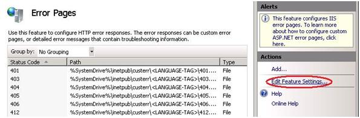
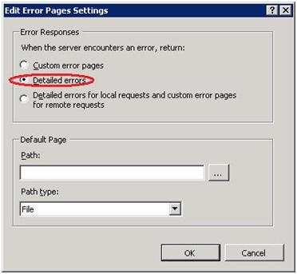

Application Request Routing (ARR) 2.0 for Shared Hosting
====================
by [Walter Oliver](https://github.com/walterov)

## Introduction

This topic is a guiding map for the information needed by hosters to:

- Learn about the Application Request Routing (ARR) 2.0 feature of IIS 7 and above.   
- Set up ARR as referenced in the [Shared Hosting Configuration article](../planning-the-web-hosting-architecture/shared-hosting-configuration.md).

Microsoft Application Request Routing (ARR) 2.0 is a proxy-based routing module that forwards HTTP requests to content servers based on HTTP headers and server variables, and load balance algorithms. A key feature of ARR is called "host name affinity," which is designed specifically for shared hosters. It affinitizes (creates an affinity) the requests to a given number of servers behind the ARR server regardless of whether they are made from one client or multiple clients, ensuring that a given site is consuming resources only on a defined number of servers. This feature allows hosters to define new business models where customers can pay for a specific number of servers as their needs change over time.

Continue to [download](https://www.iis.net/downloads/microsoft/application-request-routing) ARR 2.0.

## Learn about ARR 2.0

ARR is a key component of the Windows Web Platform &lt;link: to the Shared Hosting config article&gt;. To understand how hosters can take advantage of ARR in shared hosting scenarios, you can:

- Watch this [video](http://www.msteched.com/2010/NorthAmerica/WSV324).
- Read this [overview article](../../extensions/planning-for-arr/overview-of-shared-hosting-deployment-using-application-request-routing-20.md). It explains the difference between the current approach to shared hosting and the new approach enabled by ARR.

The following image depicts the logical flow of requests between the client and the target Web site server:

In summary, ARR's benefits include:

- HTTP(S) requests are dynamically load balanced by ARR.
- Administrators can scale the Web farm environment horizontally by adding new Web servers that do not have predefined site allocations.
- Web server resources are more evenly distributed.
- Sites have high availability.
- Administrators have only one shared configuration to manage.
- The ARR domain-server affinity feature opens a new server-to-site resource allocation model.

## Set Up ARR for Shared Hosting

The following steps and articles constitute a complete guide for setting up an ARR server and a corresponding Web server farm, as described in the [Shared Hosting Configuration article](../planning-the-web-hosting-architecture/shared-hosting-configuration.md):

1. Designate a server connected to the Internet that will run ARR and will handle all Web requests between clients and the Web application servers.
2. Install ARR using [Web Platform Installer](https://www.microsoft.com/web/downloads/platform.aspx) on the designated server.
3. Change the [application pool process model for ARR](../../extensions/installing-application-request-routing-arr/install-application-request-routing.md).
4. Set up an ARR Web server farm, using the procedure in the following [article](../../extensions/configuring-application-request-routing-arr/define-and-configure-an-application-request-routing-server-farm.md). For more information about shared configuration, see: [https://www.iis.net/learn/manage/managing-your-configuration-settings/shared-configuration\_264](../../manage/managing-your-configuration-settings/shared-configuration_264.md).  
    
5. Configure ARR for shared hosting &lt;link: [https://www.iis.net/learn/extensions/configuring-application-request-routing-(arr)/shared-hosting-using-application-request-routing-arr](../../extensions/configuring-application-request-routing-arr/shared-hosting-using-application-request-routing-arr.md)&gt;.
6. Evaluate whether high availability and scalability are required. If so, there are two approaches:

    - Use a hardware load balancer &lt;link: [https://www.iis.net/learn/extensions/configuring-application-request-routing-(arr)/achieving-high-availability-and-scalability-arr-and-hardware-load-balancer](../../extensions/configuring-application-request-routing-arr/achieving-high-availability-and-scalability-arr-and-hardware-load-balancer.md)&gt;.
    - Use NLB &lt;link: [https://www.iis.net/learn/extensions/configuring-application-request-routing-(arr)/achieving-high-availability-and-scalability-arr-and-nlb](../../extensions/configuring-application-request-routing-arr/achieving-high-availability-and-scalability-arr-and-nlb.md) &gt;.
    - Notice that the ARR server does not use shared configuration with the Web servers in the farm. But in high availability and scalability scenarios, ARR servers will be set up to share configuration between them.
7. Evaluate whether SSL is required for the hosted sites. If so, ensure that the Web servers in the ARR Web server farm are not accessible directly from the Internet. Only the ARR server(s) should be available from the Internet. This is very important since ARR uses [SSL Offloading by default](../../extensions/configuring-application-request-routing-arr/http-load-balancing-using-application-request-routing.md). If SSL is not required, disable SSL Offloading. SSL Offloading provides the following benefits:

    - It helps to maximize the server resources of the Web servers by keeping them from allocating cycles for encrypting and decrypting requests and responses.
    - The SSL certificates (for each domain) are installed once (on the ARR server), rather than on every server in the Web farm.
8. &lt;Issue: Need instructions on setting up log file directory permissions in the NAS for ARR.&gt;
9. Configure the ARR server to forward customer site error details. The ARR server must be configured to forward any error details that customers want their Web sites to send back to Web clients. After this step has been completed, customers will be able to control error page content. By default, the ARR server will forward errors but will omit the error details. Follow these steps to allow error details to be forwarded:

    1. Using IIS Manager to manage the ARR server, select the Error Pages module.
    2. In the Actions pane (on the right side), click Edit Feature Settings.
	    
    3. In the Edit Error Pages Settings dialog box, select Detailed errors, and then click OK

## Conclusion

This article provides a map to the guidance that hosters need to learn about and set up ARR in their shared hosting environments. It includes the recommended shared hosting configuration and the instructions needed to set up ARR.
