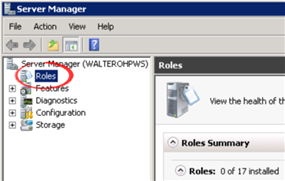
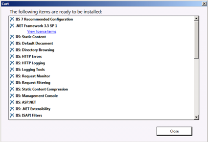
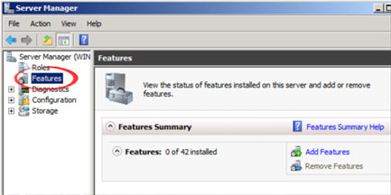
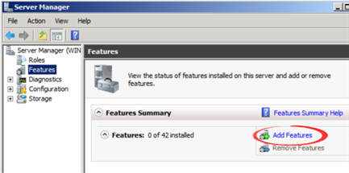
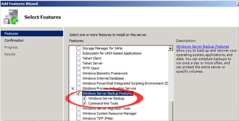
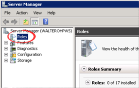

# Configure your Servers for the Windows Web Hosting Platform

by [Robert McMurray](https://github.com/rmcmurray)

## Introduction to the Windows Web Platform

The Microsoft Web Platform gives you the framework, web server, database and tools your customers need to build and run Web sites and applications on Windows. It provides a complete ecosystem of products, technologies, partners, and customers. You will be able to easily setup your servers with &lt;link:WebPI&gt;, test your environment using the same experience your users will have with &lt;link:WebMatrix&gt;, promote your offerings through the &lt;link: Hosting Gallery&gt;, and have quick access to the latest platform updates. The following sections will guide you through the process of configuring your servers using all the elements of the platform.

| **Tools** | **Customer** | **Web Hosting Provider** |
| --- | --- | --- |
| **Web Platform Installer (Web PI)** | Installs Web Platform Tools and Apps | Installs Web Plat Tools and Apps |
| **WebMatrix** | Installs/Develops Applications, Customizes, and Publishes to Hosting Provider | Supports customers publishing through WebMatrix by configuring &lt;link:Web Deploy&gt; |
| **Web Hosting Gallery** | Browse/Search for hosting | Publishes offerings |
| **Web Application Gallery** | Browse/Search for Web Applications to customize and publish to a hosting provider | Supports these popular applications |
| **WebsitePanel** | Uses it to manage their Hosting Account and resources | Uses it to manage their plans, customers, resource allocation, and provisioning |

Image 4: The Microsoft Web Platform Ecosystem

## Configure your Hyper-v Host for Shared Web Hosting

As we discussed earlier, you can setup a shared hosting environment with a basic configuration consisting of a single server. The following steps will guide you through the setup of a single server running as a Hyper-v host. This server will host the three VM Servers as described above.

To get started, setup the hyper-v host server with Windows Server 2008 R2 Enterprise. This version of Windows includes four guest licenses (Windows Server Standard or Enterprise); it allows you to setup the host with four guests and pay monthly only for the host server after you have customer websites in any of the guest servers.

a. Click the "Server Manager" button in the task bar; or click "Start" menu, type "Server Manager" and press Enter. This will bring up the Server Manager application.

   

b. On the left panel of Server Manager click on "Roles"

   

c. Under "Roles Summary" click on "Add Roles". Follow the Add Roles Wizard to Add the Hyper-v role. The wizard will ask you to reboot the computer; when you log back in, the wizard will complete the Hyper-v configuration.

   

   

## Create your Web Server VM

This section will guide you through the creation of a guest VM to be the Web Server using Windows Server 2008 R2 SP1 Standard.

a. On the host machine, click the "Start" menu, type "Hyper-v Manager" and press Enter. This will bring up the Hyper-v Manager application.

   

b. On the "Actions" bar (right side) click "New" and select "Virtual Machine". The New virtual Machine Wizard will come up.

   

c. Enter the name of the virtual machine, I usually use a descriptive name that refers to the OS version used, for example "WS2K8R2Std".

d. On the same screen, select the location of where in disk the virtual machine will be stored. Do so by checking the check box and selecting the location you will use for the Web Server VM.

   

e. If you already have a prepared virtual hard disk available, this is the moment to specify to use it for your VM; otherwise you could create one from scratch or attach one later.

   

f. The next step is to install the OS, you have several options, for some of them you need to have the OS media ready. If you have not visited the SPLA site to download Windows Server 2008 R2 SP1 Standard, now is the time. You can use the downloaded OS in this step or do it later from a DVD, network drive, or network-based installation server.

   

From this point on your VM will be ready for you to start and connect to, use the Hyper-v Manager and double click on the machine listed under "Virtual Machines" in the center panel.

## Configure the Web Server Components to support WebMatrix

This article will walk you through installing the required server components to be **WebMatrix compatible** and fulfill the **Spotlight requirements** for the Web Hosting Gallery.

To simplify the installation of the **web server** components, we highly recommend installing Web Platform Installer, also known as WebPI, on both machines. WebPI is a tool that automates the installation of a vast majority of server components and other products for Microsoft's Web Platform.

If you prefer to not use WebPI, all of the required components can also be installed by hand or via your own provisioning scripts.

### Option 1: Via Web Platform Installer 3.0 (recommended)

If you have WebPI 3.0 installed, the following link will automatically launch it with all of the basic web server components you'll need ready to install:

1. Login in the VM created in the previous section, use your administration account. Notice that these instructions will work regardless of whether you are using a VM or an actual machine.
2. [Install Spotlight Components using Web PI](https://www.microsoft.com/web/gallery/install.aspx?appid=WHP_Recommended). This link will install WebPI (if you have not done so already) and will let you review the list of products and dependencies before you start the process of installing the components. Notice that this list of components completely fulfills the Spotlight requirements from the Web Hosting Gallery.

   

3. Once the Web PI window is displayed, click the "Items to be installed" link to review the list of products and dependencies.

   

4. Scroll down to see the rest of the items in the list:

   

   Here is the list of Products to install:

   1. IIS 7 or above Web Server including the following modules: Web Deploy 2.0, FTP, IIS Remote Management Services, CGI, URL Rewrite 2.0, SQL Server 2008 Management Objects (SMO), Windows Cache 1.1 for PHP, MySQL Connector, Microsoft SQL Server Driver for PHP 2.0
   2. Frameworks: .NET 3.5 SP1, .NET 4.0, ASP.NET, ASP.NET MVC, and PHP 5.2.14 or higher

5. Review the license page and accept the terms to continue with the install:

   

   

6. If you are not using Windows Server 2008 R2 **SP1**, install the following Web Server Patch: [Extensionless URL Hotfix](https://support.microsoft.com/kb/980368). This hotfix is required for ASP.NET Web Pages to function correctly. 
7. (Optional) [Install Spotlight Components plus PHP/MySQL related components using Web PI](https://www.microsoft.com/web/gallery/install.aspx?appid=IIS7;Tracing;NETFramework35;NETFramework4;ASPNET;MVC;WDeploy;FTPServer;ManagementService;CGI;URLRewrite2;SMO;PHP52;WinCache52;MySQLConnector;SQLDriverPHP52IIS). Many of the web applications that can be published by WebMatrix have PHP/MySQL components as requirements. To ensure you are able to support those applications, you can use this link to install everything above plus PHP/MySQL related components

### Option 2: Manually install Web Server components

Here is the full list of which components are installed by those links, so you can confirm against the list of products listed in WebPI. Note that many of them bring in dependencies – that is expected behavior – but the total download should not exceed 50 MB or so.

Server:

- [Required] [IIS 7 Web Server](https://www.microsoft.com/web/gallery/install.aspx?appsxml=&amp;appid=IIS7;Tracing) basic components. Required for basic web server functionality.

Frameworks:

- [Required] [.NET Framework 3.5 SP1](https://www.microsoft.com/web/gallery/install.aspx?appsxml=&amp;appid=NETFramework35). [Some applications](https://www.microsoft.com/web/gallery/) depend on this framework
- [Required] [.NET Framework 4.0](https://www.microsoft.com/web/gallery/install.aspx?appsxml=&amp;appid=NETFramework40). [Some applications](https://www.microsoft.com/web/gallery/) depend on this framework
- [Optional] PHP (5.2.14 or higher). This is not required for Spotlight, but many applications that can be published by WebMatrix depend on this framework

ASP.NET:

- [Required] [ASP.NET](https://www.microsoft.com/web/gallery/install.aspx?appsxml=&amp;appid=ASPNET). This framework is the backend of many of the most popular web applications
- [Required] [ASP.NET MVC 1.0](https://www.microsoft.com/web/gallery/install.aspx?appsxml=&amp;appid=MVC). A handful of applications in the App Gallery depend on this installed centrally
- [Optional] You can also optionally install [ASP.NET MVC3](https://www.microsoft.com/web/gallery/install.aspx?appsxml=&amp;appid=MVC3) and [ASP.NET Web Pages](https://www.microsoft.com/web/gallery/install.aspx?appsxml=&amp;appid=Plan9), which gives you the ability to host applications written in the new "Razor" syntax of ASP.NET. However, note that the binaries required for these kinds of applications are automatically published by WebMatrix. That is, each end user who publishes applications of this type will automatically end up with the required binaries in a /bin/ folder within their site root directory, so it is not really necessary to install them centrally.

IIS Modules:

- [Required] [Microsoft Web Deploy](https://www.iis.net/downloads/microsoft/web-deploy). Web Deploy is a client-server tool that simplifies the deployment of sites and applications to IIS servers. While WebMatrix supports web application publishing using both FTP and Web Deploy protocols, the latter providers a faster, more secure, and richer experience. It also lets the user deploy whole apps, including databases, ensuring they work both locally and remotely. It is the highlight of the WebMatrix publishing story.
- [Required] [FTP Publishing Service](https://www.iis.net/downloads/microsoft/ftp). To ensure the option of FTP exists for maximum compatibility
- [Required] [IIS Remote Management Service](https://www.iis.net/downloads/microsoft/iis-manager). To allow your users to manage aspects of their accounts using the IIS console. Also a dependency for Web Deploy to function properly
- [Required] [FastCGI for IIS](https://www.iis.net/downloads/microsoft/fastcgi-for-iis). Provides a much faster CGI implementation than the default
- [Required] [URL Rewrite](https://www.iis.net/downloads/microsoft/url-rewrite). A dependency for many applications to function correctly
- [Required] [SQL Server 2008 Management Objects](https://www.microsoft.com/downloads/en/details.aspx?FamilyID=ceb4346f-657f-4d28-83f5-aae0c5c83d52). A dependency for many applications to function correctly, and for WebDeploy to manage SQL Server db's.
- [Optional] [Windows Cache Extension 1.1 for PHP](https://www.iis.net/downloads/microsoft/wincache-extension). Highly recommended when running PHP on Windows.
- [Optional] [MySQL Connector/Net](http://dev.mysql.com/downloads/connector/net/) 6.2.3 or higher. Necessary for .NET applications using MySQL databases
- [Optional] [Microsoft Drivers for PHP for SQL Server](https://www.microsoft.com/downloads/en/details.aspx?FamilyID=80e44913-24b4-4113-8807-caae6cf2ca05) in IIS. Necessary for PHP applications using SQL Server
- [Extensionless URL Hotfix](https://support.microsoft.com/topic/a-update-is-available-that-enables-certain-iis-7-0-or-iis-7-5-handlers-to-handle-requests-whose-urls-do-not-end-with-a-period-525f06bd-125b-9fb7-0564-327172f1912f). Needed only if you are not using Windows 2008 R2 **SP1**. Required for ASP.NET Web Pages to function correctly. It is discussed further in this blog post.

Database Server Components (see next section):

- [Optional] [PHP Driver for SQL Server](https://www.microsoft.com/web/gallery/install.aspx?appsxml=&amp;appid=SQLDriverPHP). We highly recommended installing this component on your database server if you are supporting PHP.

Next Steps:

• Proceed to configure the database server machine.

• Ensure that the Web Deploy 2.0 (or higher) component is [configured to allow delegated deployments](../joining-the-web-hosting-gallery/configure-site-for-web-deploy-publishing.md). This is critical, as it is the primary method that allows your customers to publish to your servers with WebMatrix.

<!-- TODO: Add link to the ASP.NET Shared Hosting Guide -->

**Create &amp; Configure your SQL Server VM**

Create a second guest as the Database Server Virtual Machine

1. Follow the same steps outlined in "Create your Web Server VM" to create the Database Server VM.
2. Add Database Server Components to the Database VM

    1. Download the SQL Server 2008 R2 Web media from the SPLA site, find the link in the email you received confirming your SPLA agreement.
    2. [Required] Install SQL Server 2008 R2 Web on the Database VM. Follow the installation wizard instructions. WebPI supports installing [Microsoft SQL Server 2008 Express edition](https://www.microsoft.com/web/gallery/install.aspx?appsxml=&amp;appid=SqlExpress), but we do not recommend this product in shared hosting environments, you should use the full version instead on a separate server.
    3. Install MySQL, use the following related [article](../joining-the-web-hosting-gallery/setup-mysql-with-webmatrix-support.md) to ensure the installation supports WebMatrix.

## Configure your Content Server VM

Create a third guest as the Content Server Virtual Machine

1. Download the Windows Server 2008 R2 Enterprise media from the SPLA site, find the link in the email you received confirming your SPLA agreement.
2. Follow the same steps outlined in 2.a to create the VM Server.
3. Install the Windows Server Backup features in the content server:

   1. Click the "Server Manager" button in the task bar; or click "Start" menu, type "Server Manager" and press Enter. This will run the Server Manager application.

      

   2. On the left panel of Server Manager click on "Features"

      

   3. Under "Features Summary" click on "Add Features". Follow the Add Features Wizard to Add the Backup service.

      

      

1. Install the File Services role in the content server.

   1. Click the "Server Manager" button in the task bar; or click the "Start" menu, type "Server Manager" and press Enter. This will run the Server Manager application.

      

   2. On the left panel of Server Manager click on "Roles"

      

   3. Under "Roles Summary" click on "Add Roles". Follow the Add Roles Wizard to Add the "File Services" role.

      

      

## Configure your Control Panel Server VM

Create a second Web Server VM, configure follow the same steps that you did for the first Web Server. This server will act as the Control Panel server; it will host WebsitePanel (we will install it in a subsequent section). It could also help you troubleshoot websites issues. This final VM will complete the four guests allowed by your Windows Server Enterprise 2008 R2 license. **If you are planning on a larger deployment, you may want to use the Windows Server 2008 R2 Datacenter edition which has no license limits on guests.**
