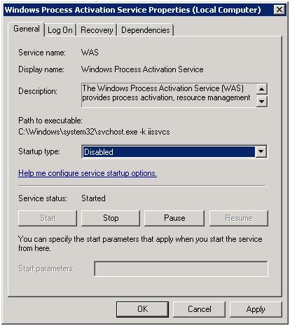
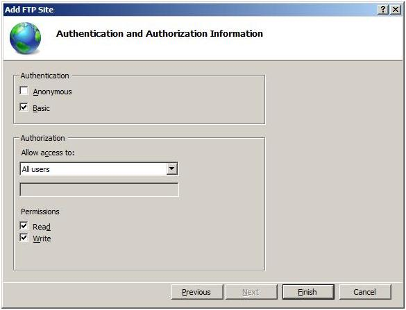
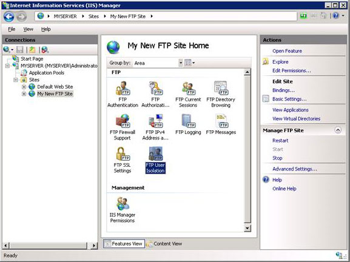
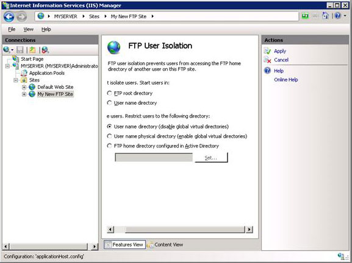
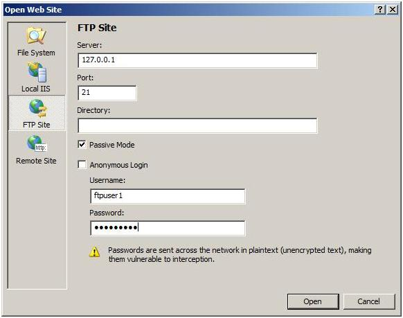
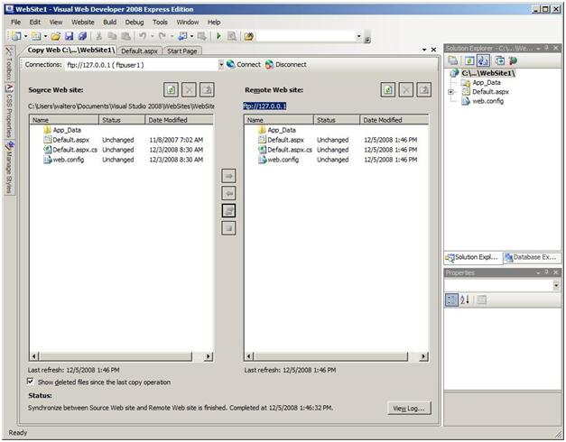

Guide to Deploy FTP and Publish with VWD
====================
by [Walter Oliver](https://github.com/walterov)

## Introduction

The FTP service for IIS is a key component of the Windows Web Platform. It provides a robust, secure solution for FTP in a Windows environment. [Shared hosting](../planning-the-web-hosting-architecture/shared-hosting-configuration.md "Shared hosting") environment administrators can use [FTP for IIS](../../publish/using-the-ftp-service/index.md "FTP for IIS 7.0") to enable their customers to upload and synchronize their content. The article [What Is New for Microsoft and FTP?](../../get-started/whats-new-in-iis-7/what39s-new-for-microsoft-and-ftp-in-iis-7.md "What is New for Microsoft and FTP?") introduces the new FTP features. Here are the highlights:

- **Integration with IIS:** 

    - New configuration store based on the .NET XML-based \*.config format
    - New administration tool
- **Security and support for new Internet standards:** 

    - FTP over SSL
    - Non-Windows accounts for authentication
    - UTF8 and IPv6
- **Shared hosting improvements:** 

    - Host FTP and Web content from the same site by adding an FTP binding to an existing Web site
    - Virtual host name support, making it possible to host multiple FTP sites on the same IP address
    - Improved user isolation, through per-user virtual directories
- **Improved logging and supportability features:** 

    - Enhanced FTP logging includes all FTP-related traffic, unique tracking for FTP sessions, FTP sub-statuses, and additional detail fields in FTP logs
    - Detailed error responses when logging on locally to an FTP server
    - Detailed information when using Event Tracing for Windows (ETW), which provides additional information for troubleshooting

The following [video](https://mediadl.microsoft.com/mediadl/IISNET/Media/HDA20-IIS/Secure%20and%20Simplified%20Web%20Publishing%20using%20IIS7.wmv "video") provides an overview and demonstrations of several of the features in FTP 7.0.

## Deploying FTP

FTP is one of the front-end servers in the [shared hosting configuration](../planning-the-web-hosting-architecture/shared-hosting-configuration.md "shared hosting configuration").

This image highlights several important characteristics of FTP deployment in the shared hosting environment:

1. The FTP service can share the same computer that is used for the Remote Administration (Web Management - WMSVC) &lt;need link&gt; and MS Deploy services &lt;need link&gt;.
2. The FTP computer is part of the [shared configuration](../planning-the-web-hosting-architecture/shared-hosting-configuration.md "shared configuration") that is used by the Web farm servers, which means that the components installed on this computer should also be on the Web farm servers. However, since the Web farm will not be used to process FTP requests, the FTP, Web Management (WMSVC), and MS Deploy services can be stopped &lt;need link&gt;.
3. The FTP computer is not intended to host Web applications.
4. The Internet-facing firewall router performs the port forwarding of FTP traffic to the FTP server.

### 

### Deployment Configuration

The FTP for IIS server has several features that make it ideal for shared hosting scenarios. The guidelines below take advantage of the new FTP User Isolation feature. This feature allows:

- Administrators to limit user access to only the physical or virtual directory defined for the user. This means implementing a single FTP site; this site will contain a specific physical or virtual directory for each user name.
- Administrators to enable SSL and use a single certificate for all connections when explicitly required by users.
- Users to view the FTP site as if it were only theirs. When they log on to the FTP server, they will be restricted to their specific directory and will not be able to navigate up the directory tree.

#### Steps:

1. Select the FTP computer and install the new FTP for IIS service. Follow the instructions found in [Installing and Troubleshooting FTP](../../install/installing-publishing-technologies/installing-and-configuring-ftp-7-on-iis-7.md "Installing and Troubleshooting FTP 7.0").
2. Create a root folder to be used for your FTP site, for example: `%*SystemDrive*%\inetpub\ftproot`.
3. Optionally, if there are FTP high availability and/or load balancing requirements, Microsoft provides solutions such as [Network Load Balance](https://technet.microsoft.com/en-us/library/cc732855.aspx "Network Load Balance") or [Failover Clusters](https://technet.microsoft.com/en-us/library/cc732488.aspx "Failover Clusters"), DNS round-robin might be sufficient.
4. Create a site that allows SSL connections and Basic authentication. Follow the steps in the Create SSL Enabled Site section &lt;link to section below&gt;.
5. Enable the User Isolation feature. Follow the steps in the Configure User Isolation for All Directories section &lt;link to section below&gt;.
6. Configure the FTP firewall settings as described in the corresponding section below &lt;link to section below&gt;.
7. Stop the Windows Process Activation Service (WAS):

    - At the command prompt, type **services.msc** This will display the Services console.  
        
    - Double-click **Windows Process Activation Service**.  
        
    - In the Windows Process Activation Service Properties dialog box, ensure that the Startup Type for this service is set to Disabled. Click **Stop**, and then click **OK**.

## Create SSL Enabled Site

In this section, you will create a new FTP site that can be opened by using any of your user accounts.

1. Go to IIS Manager. In the Connections pane, click the Sites node in the tree.
2. Right-click the Sites node in the tree, and click **Add FTP Site**, or click **Add FTP Site** in the Actions pane.  
    
3. When the Add FTP Site Wizard appears:

    - Enter "My New FTP Site" in the **FTP site name** text box, and then navigate to the root folder that you created for your FTP site (example: `%*SystemDrive*%\inetpub\ftproot`). > [!NOTE]
 > If you choose to type in the path to your content folder, you can use environment variables in your paths.
    - Click **Next**.  
        
4. On the next page of the wizard:

    - Choose an IP address for your FTP site in the **IP Address** text box, or choose to accept the default selection of "All Unassigned." This example uses the local loopback IP "127.0.0.1".
    - Enter the TCP/IP port for the FTP site in the **Port** text box. This example uses the default port of "21".
    - Ensure that the **Virtual Host** text box is blank. Do not use a host name.
    - Make sure that the **Certificates** drop-down list is set to the appropriate certificate that you intend to use. This example uses a self-signed certificate called "My FTP Certificate." For instructions, see [Creating a Self-signed SSL Certificate](../../publish/using-the-ftp-service/using-ftp-over-ssl-in-iis-7.md#02 "Creating a Self-signed SSL Certificate").
    - Ensure that the **Allow SSL** option is selected.
    - Click **Next**.  
        
5. On the next page of the wizard:

    - Select **Basic** for the **Authentication** settings.
    - For the **Authorization** settings:

        - Choose "All users" from the **Allow access to** drop-down list.
        - Select **Read** and **Write** for the **Permissions** option.
    - When you have completed these items, click **Finish**.  
        

#### Summary

You have now created a new SSL-based FTP site using the new FTP service. Review the items that you completed in this procedure:

- You created a new FTP site named "My New FTP Site" that puts the site's content root at `%*SystemDrive*%\inetpub\ftproot`.
- You bound the FTP site to the IP address for your computer on port 21.
- You chose to allow Secure Sockets Layer (SSL) for the FTP site, and selected your certificate.
- You enabled Basic authentication and created an authorization rule for all user accounts for Read and Write access.

For direct editing of the XML configuration files, see [Adding SSL-based FTP Publishing by Editing the IIS Configuration Files](../../publish/using-the-ftp-service/using-ftp-over-ssl-in-iis-7.md#04 "Adding SSL-based FTP Publishing by Editing the IIS 7.0 Configuration Files").

## Configure User Isolation for All Directories

When isolating users for all directories, all FTP user sessions are restricted to the physical or virtual directory that has the same name of the FTP user account. In addition, all global virtual directories that are created will be ignored. In this step you will configure user isolation for all directories.

1. Create a folder at `%*SystemDrive*%\inetpub\ftproot\LocalUser\`. This folder will contain all local user account directories. You may create this folder on your File Share server (NAS). When you provision user accounts, you must also assign read and write access to the users' content folders.
2. In IIS Manager, click the node for the FTP site that you have just created. This will display the icons for all of the FTP features.
3. Double-click the FTP User Isolation icon to open the FTP user isolation feature.  
    
4. When the FTP User Isolation feature page is displayed, select **User name directory (disable global virtual directories)**, and then click **Apply** in the Actions pane.  
    

#### Summary

Reviewing the items that you completed in this procedure: you configured FTP user isolation using the **User name directory (disable global virtual directories)** option. When using this mode of user isolation, all FTP user sessions are restricted to the virtual or physical directory with the same name of the FTP user account, and any global virtual directories that are created will be ignored.  
   
To create home directories for each user, you first need to create a virtual or physical directory under your FTP server's root folder that is named after your domain or named LocalUser for local user accounts. Next, you need to create a virtual or physical directory for each user account that will access your FTP site. The following table lists the home directory syntax for the authentication providers that ship with the FTP service:

| **User Account Type** | **Physical Home Directory Syntax** |
| --- | --- |
| Anonymous users | %*FtpRoot*%\LocalUser\Public |
| Local Windows user accounts (requires Basic authentication) | %*FtpRoot*%\LocalUser\%*UserName*% |
| Windows domain accounts (requires Basic authentication) | %*FtpRoot*%\%UserDomain%\%*UserName*% |
| IIS Manager or ASP.NET custom authentication user accounts | %*FtpRoot*%\LocalUser\%*UserName*% |

(> [!NOTE]
> In the above table, %*FtpRoot*% is the root directory for your FTP site; for example, C:\Inetpub\Ftproot.) Global virtual directories are ignored; virtual directories that are configured at the root-level of your FTP site cannot be accessed by any FTP users. All virtual directories must be explicitly defined under a user's physical or virtual home directory path. 

## Configure the FTP Firewall Settings

### Configure the Passive Port Range for the FTP Service

In this section, you will configure the server-level port range for passive connections to the FTP service. Use the following steps:

1. Go to IIS Manager. In the Connections pane, click the server-level node in the tree.  
    
2. Double-click the **FTP Firewall Support** icon in the list of features.  
    
3. Enter a range of values for the **Data Channel Port Range**.  
    
4. Once you have entered the port range for your FTP service, click **Apply** in the Actions pane to save your configuration settings.> [!NOTE]
>  

    - The valid range for ports is 1025-65535. (Ports 1-1024 are reserved for use by system services.)
    - You can enter a special port range of "0-0" to configure the FTP server to use the Windows TCP/IP dynamic port range.
    - For additional information, see the following Microsoft Knowledge Base articles:

        - 174904 - [Information about TCP/IP port assignments](https://support.microsoft.com/kb/174904/ "Information about TCP/IP port assignments")
        - 929851 - [The default dynamic port range for TCP/IP has changed in Windows Vista and in Windows Server 2008](https://support.microsoft.com/kb/929851/ "The default dynamic port range for TCP/IP has changed in Windows Vista and in Windows Server 2008")
    - This port range will need to be added to the allowed settings for your firewall server.
5. Enter the IPv4 address of the external-facing address for your firewall server for the **External IP Address of Firewall** setting.  
    
6. Once you have entered the external IPv4 address for your firewall server, click **Apply** in the Actions pane to save your configuration settings.

#### Summary

Review the items that you completed in this procedure: 

1. You configured the passive port range for your FTP service.
2. You configured the external IPv4 address for a specific FTP site.

For information about how to configure the Windows Server 2008 Firewall, see [(Optional) Step 3: "Configure Windows Firewall Settings](../../publish/using-the-ftp-service/configuring-ftp-firewall-settings-in-iis-7.md#Step3 "(Optional) Step 3: Configure Windows Firewall Settings"). Also see [More Information about Working with Firewalls](../../publish/using-the-ftp-service/configuring-ftp-firewall-settings-in-iis-7.md#MoreInfo "More Information about Working with Firewalls").

## FTP Server Names Examples

FTP is a commonly included service when hosters provision accounts for their customers. The instructions provided above will enable the FTP for IIS service for customers, but the FTP server name, if based simply on the hosting company name, may look something like this:

ftp.hostingcompany.comSuch a name may be sufficiently clear for all users; when customers use it to connect to their FTP directory they will land in their directory and will be able to see only their folders. But the FTP server name may not be as appealing to customers as an FTP server name based on their reserved domain, such as:

- ftp.customerdomain.com
- customerdomain.com

If customers have their FTP server name associated with their reserved domain name, the FTP service experience will be more personalized and appealing. Functionally, it is the same as the previous example, but this option simplifies the domain naming for the customer. To set up a custom FTP server name for each customer, you will need to create appropriate DNS records for the customer domain. This will require additional provisioning steps.If you provide a custom FTP server name for each customer, you may also want to provide an alternative server name to prevent FTP service outage when domain names are being updated. An example of an alternative name to provide along with the custom name could look like:ftp.username.hostingcompany.comIn such a case, customers would receive two server names and would be able to connect to the same directory by using either name; for example:

- ftp.customerdomain.com (or customerdomain.com)
- ftp.username.hostingcompany.com

## Connect from Visual Web Developer

This article has so far focused on how to deploy FTP in a shared hosting environment. This section describes how customers can take advantage of Visual Web Developer 2008 &lt;link: to download page&gt; (VWD) to publish their Web applications by using the FTP service provided by the hoster. The following example assumes that: 

- The hosting company has provisioned an account to a user named "ftpuser1".
- The hosting company has created the corresponding virtual folder "*ftproot*\LocalUser\*ftpuser1*".

To publish Web application content with VWD, ftpuser1 performs the following steps:

1. Ftpuser1 opens the Web site called "WebSite1" in Visual Web Developer 2008 (VWD).  
    
2. Ftpuser1 selects Copy Web Site from the Website menu.  
    
3. Ftpuser1 clicks **Connect**.  
    
4. Ftpuser1 enters the following values:

    - The FTP server name provided by the hosting company. In the example below, the loopback IP address is 127.0.0.1.
    - Port. In the example below, the default value is port 21.
    - Passive Mode option.
    - Basic authentication option. Ftpuser1 deselects Anonymous Login.
    - User name: ftpuser1.
    - Password.
5. Ftpuser1 then clicks **Open**.  
    
6. Ftpuser1's folder appears in the Remote Web Site pane. In the following example, the pane is empty because ftpuser1 is publishing the Web site for the first time.  
    
7. Ftpuser1 publishes all content items in the Source Web Site pane by selecting all files and folders, and then clicking **Synchronize**:

    - Ftpuser1 clicks the left pane.
    - Ftpuser1 types **Ctrl+A**, to select all files.
    - Ftpuser1 clicks **Synchronize** (located in between the two panes, third button from the top).  
        
8. The files and folders are uploaded to the FTP server and stored in the user's virtual directory: ftpuser1. (The user will be unaware of other users' content on the same server because of the User Isolation restriction.)  
    

## Conclusion

This guide provides the information needed to install and configure an FTP for IIS service in a shared hosting environment. It also shows how customers can take advantage of Visual Web Developer to publish their content to their FTP site directory. 