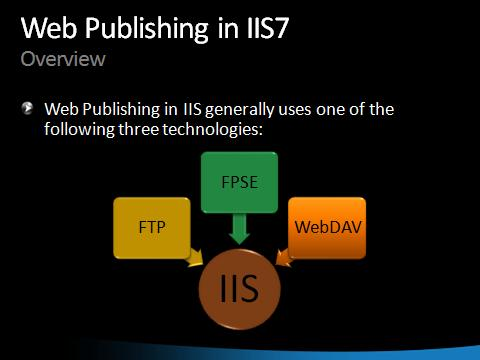

# Publishing Components: FTP 7.0, WebDAV, and FPSE

by [Walter Oliver](https://github.com/walterov)

## Overview

The following [video](https://mediadl.microsoft.com/mediadl/IISNET/Media/HDA20-IIS/Secure%20and%20Simplified%20Web%20Publishing%20using%20IIS7.wmv "IIS Publishing") and presentation [IIS Publishing](publishing-components-ftp-70-webdav-and-fpse/_static/publishing-components-ftp-70-webdav-and-fpse-55-securesimplifiedwebpublishingusingiis71.zip) will provide you with an overview of the IIS Publishing Features and step-by-step demonstrations on how to take advantage of them.

## Link to Guide

For a complete set of deployment and configuration information on FTP 7.0, WebDAV, and FrontPage Server Extensions for IIS 7.0 and above, see [Publishing Content to Web Sites](../../publish/index.md).
