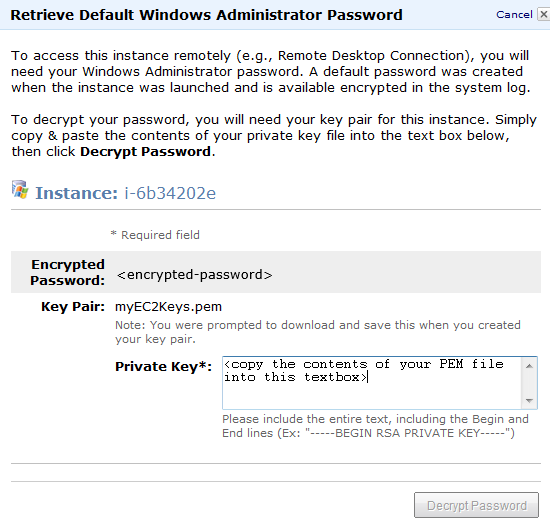

# Amazon EC2: Microsoft Web Platform - DotNetNuke

by [Thomas Deml](https://github.com/thomasdeml)

## Introduction

One thing we often hear from Web developers, especially those who offer Web site design and consulting services, is the need to get a Web site up quickly, which runs fast and gives them total control of the server for maximum flexibility and scalability. Today's post offers a quick walkthrough on how to run [DotNetNuke](http://www.dotnetnuke.com/ "DotNetNuke") on Amazon's [EC2](http://aws.amazon.com/ec2/) Cloud and the [Microsoft Web Platform](https://www.microsoft.com/web). After you followed the steps in this walkthrough you will have a live production DotNetNuke site on the Internet.

Here are quick summary of the steps you have to follow:

1. Sign up for Amazon EC2
2. Start the "Microsoft Web Platform - DotNetNuke" image via the Amazon Web Services Management Console.
3. Retrieve the Administrator password and connect to the image via RDP.
4. Finalize the DotNetNuke installation.
5. Enter blog posts and browse to your blog.

## 1. Amazon EC2 Sign-up

Signing up for Amazon EC2 is a straightforward process. All you need is

- a valid e-mail address,
- a valid phone number you can be reached at (make sure the phone is nearby, you will be called during sign-up!),
- and a valid credit card number

The sign-up URL is [http://aws.amazon.com/ec2](http://aws.amazon.com/ec2). It's even easier if you are already an Amazon customer because you can use your existing credit card information and e-mail address.

Note: Billing data verification usually happens within minutes. It might take a couple of hours though. Currently (April 2010) the error message you get is not very meaningful:  
*"It looks like you don't have an EC2 account\*. To use the Amazon EC2 Console you must first sign up for Amazon EC2. It's quick &amp; free to sign up."*  
 Just be patient and wait for a little longer.

## 2. Starting an "Microsoft Web Platform – DotNetNuke" Instance

Once you are signed up successfully you will have access to the Amazon EC2 Management Console. The URL is [https://console.aws.amazon.com/ec2/home](https://console.aws.amazon.com/ec2/home).

  
Once you are logged in make sure you switch your region to "US West". The Microsoft Web Platform images are currently only available in the US West region. Before we do anything lets set up the firewall rules (called Security Groups in Amazon lingo) for your DotNetNuke instance. 

### Firewall Rules

Select the item "Security Groups" on the left hand side. Your existing Security Groups will show in the center pane. Click the "Create Security Group" button on top.

Name the new group you are about to create, for example "Microsoft Web Platform Firewall Rules".

You want to configure the following rules:

- RDP is needed so you can connect via Remote Desktop to your Amazon EC2 instance. The current "Source (IP or group)" settings allows these connections from any IP address. Please lock down this settings if you have more stringent security requirements.
- HTTP is needed so your customers can connect via HTTP your Amazon EC2 instance.
- HTTPS is needed if you plan to use SSL. You don't need this setting if you do not plan to use SSL.
- Port 8172 is opened to allow remote administration of IIS and publishing of content via Visual Studio 2010. You don't have to open port 8172 if you do not plan to use remote administration or remote content publishing.

Now we are ready to launch an EC2 DotNetNuke instance.

Launching an DotNetNuke Instance

Click the "Instances" menu item on the left hand side and click the "Launch Instance" button.   

Now select "Community Images" in the resulting dialog.

By typing "microsoft/" in the "Community AMIs" dialog you will reduce the selection to the four Microsoft images:  
 Press "Select" in the "Microsoft Web Platform – DotNetNuke…" row.

In the next dialog page (Instance Details) you can select how much computing power you want to have for your DotNetNuke instance. It's probably prudent to start with type small. Click the "Continue" button. Nothing to worry about on the next page either. Just click "Continue" at the bottom of the "Advanced Instance Options" dialog. Now we are getting to the "Create Key Pair" dialog.   

If you already have a key, simply use it. If not you have to create one by entering a name for your key pair and clicking the "Create &amp; Download Key Pair" button. As soon as you click the button a key pair will be created by Amazon an you are asked by your browser to download it. Save the file in a location where you will find it later. The key pair you created will allow you to decrypt the Administrator password that Amazon creates for your DotNetNuke instance. Click the "Continue" button.

Note: Internet Explorer might not show the download dialog that asks you where to save the key pair file. If that happens to you, please look for the file (&lt;key pair name&gt;.pem) in Internet Explorers Temporary Files folder. On Windows 7 search for \*.pem in `%userprofile%\ AppData\Local\Microsoft\Windows\Temporary Internet Files`. Make sure you copy the .pem file to a more permanent directory .

Once you created your key pair you can configure firewall rules. You could for example only allow HTTP requests to the machine. Amazon calls firewall rules "Security Groups" which is a bit confusing if you ask me. For this demo we are picking the "default" Security Group which doesn't put any firewall restrictions on the instance. You might want to configure these settings to be a bit more restrictive later on.   
Click "Continue" to move to the "Launch" page. The only thing left to do on the summary page is to press the big "Launch" button. Once you do that Amazon EC2 will spin up your personal virtual instance of our DotNetNuke image. Good job. It's time to get some coffee. Spinning up your instance will take some time, usually around 3 to 5 minutes.

## 3. Retrieving the Administrator Password

After finishing the "Launch Instance" wizard you should be back on the main page of the AWS Management Console. Click the "Instances" link to figure out how your DotNetNuke instance is doing.

You should see something like this:

Right click on the row and select the "Get Windows Password" menu item.

Now it's time to use the key pair file (&lt;your key pair name&gt;.PEM) that you created before. If the password is already available (you might have to wait a couple of minutes as said before) you will see the following dialog:

Open the .PEM file in notepad and copy it to the clipboard (Ctrl+A selects all, Ctrl+C copies it into the clipboard). Now paste the contents into the textbox of the dialog (Ctrl+V). Click the "Decrypt" button.

Note: Because decryption is a very CPU intensive operation you might run into the following security dialog if you use Internet Explorer:  Contrary to intuition you have to press "No" to go on. You probably have to hit "No" a couple of times to get your password decrypted. More details on this security feature can be found here: [https://support.microsoft.com/kb/175500](https://support.microsoft.com/kb/175500)  
If you are interested in a more permanent fix you can execute the following command on command-line: 

[!code-console[Main](amazon-ec2-microsoft-web-platform-dotnetnuke/samples/sample1.cmd)]
  
 By setting the MaxScriptStatements to 100,000,000 (0x5F5E100) I don't see any security popups anymore.

Once the password is decrypted write it down or copy it to the clipboard and close the dialog. Finally we are ready to connect to the DotNetNuke instance. Right click the instance and select "Connect".

Click "Download shortcut file" in the dialog that follows:

The file to be downloaded is an .RDP file that has all the right settings to connect you to the EC2 instance in the cloud. Click "Open" if you use IE or double click the file in Firefox's Download window and a Remote Desktop session is established. When Remote Desktop asks you for credentials you simply enter the username "Administrator" and the password that we retrieved previously.   
Once connected you will get logged on to the remote machine. Don't get to impatient because after the logon it will take a few moments until the DotNetNuke install kicks in.

## 4. Finalization of the DotNetNuke Installation

When you log into the DotNetNuke EC2 instance a logon script will open the [http://localhost/](http://localhost/) address in Internet Explorer. This is will open the DotNetNuke Installation Wizard which allows you to enter your hopefully secure passwords and other settings.

Once the wizard completes you are ready to go.

One last tip: You can get to your blog from outside the Remote Desktop session. Your instance has a public DNS address you can use.

Copy the public DNS name shown in the AWS Management Console to the clipboard and enter it into the browser. If you need a more permanent DNS address you have to register a DNS name and also get an Elastic IP address from Amazon. But this is a story for another day.

## Summary

It's amazing how easy it now is to get a dedicated Web server on the internet and get started. We just deployed a working and fully configured Content Management System to the cloud. Let us know what you think about this:Questions or feedback? Send it to [ec2@microsoft.com](mailto:ec2@microsoft.com).
