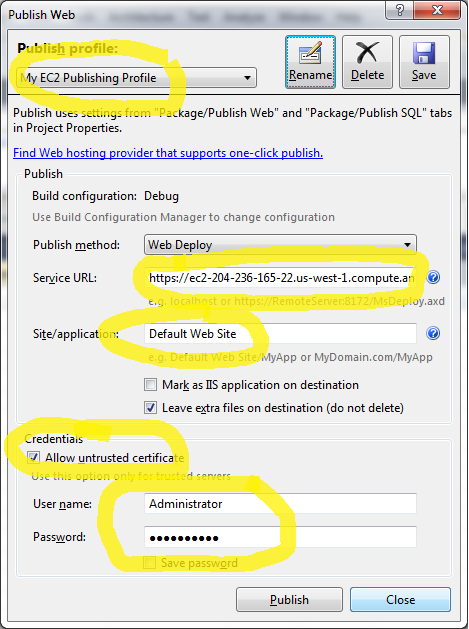

Amazon EC2: Microsoft Web Platform Images - Full Web Server Development Stack
====================
by [Thomas Deml](https://github.com/thomasdeml)

### Introduction

Visual Studio 2010 enables web developers to use their existing skillset to write great applications for the Microsoft Web Platform. But one thing we often hear from Web developers and administrators, especially those who offer Web site design and consulting services, is the need to get a Web site up and live quickly, which runs fast and gives them total control of the server for maximum flexibility and scalability. Today's post offers a quick walkthrough on how to run the newest Microsoft Web Server Development Stack on Amazon EC2. The Full Web Server Development Stack image is a fully configured IIS 7.0 or above web server which allows you to deploy your web application directly from Visual Studio 2010 to this EC2 instance.

Here are quick summary of the steps you have to follow:

1. Sign up for Amazon EC2
2. Start an "Microsoft Web Platform - Full Web Server Development Stack" instance via the Amazon Web Services Management Console.
3. Retrieve the Administrator password
4. Create and deploy an ASP.NET 4.0 application from Visual Studio 2010 to your EC2 instance.
5. Browse to your live web application

## 1. Amazon EC2 Sign-up

Signing up for Amazon EC2 is a straightforward process. All you need is

- a valid e-mail address,
- a valid phone number you can be reached at (make sure the phone is nearby, you will be called during sign-up!),
- and a valid credit card number

The sign-up URL is [http://aws.amazon.com/ec2](http://aws.amazon.com/ec2). It's even easier if you are already an Amazon customer because you can use your existing credit card information and e-mail address.

Note: Billing data verification usually happens within minutes. It might take a couple of hours though. Currently (April 2010) the error message you get is not very meaningful:  
*"It looks like you don't have an EC2 account\*. To use the Amazon EC2 Console you must first sign up for Amazon EC2. It's quick &amp; free to sign up."*  
Just be patient and wait for a little longer.

## 2. Starting an "Microsoft Web Platform – Full Web Server Development Stack" Instance

Once you are signed up successfully you will have access to the Amazon EC2 Management Console. The URL is [https://console.aws.amazon.com/ec2/home](https://console.aws.amazon.com/ec2/home).

  
Once you are logged in make sure you switch your region to "US West". The Microsoft Web Platform images are currently only available in the US West region. Before we do anything lets set up the firewall rules (called Security Groups in Amazon lingo) for your Web Development Stack instance.

### Firewall Rules

Select the item "Security Groups" on the left hand side. Your existing Security Groups will show in the center pane. Click the "Create Security Group" button on top.

Name the new group you are about to create, for example "Microsoft Web Platform Firewall Rules".

You want to configure the following rules:

- RDP is needed so you can connect via Remote Desktop to your Amazon EC2 instance. The current "Source (IP or group)" settings allows these connections from any IP address. Please lock down this settings if you have more stringent security requirements.
- HTTP is needed so your customers can connect via HTTP your Amazon EC2 instance.
- HTTPS is needed if you plan to use SSL. You don't need this setting if you do not plan to use SSL.
- Port 8172 is opened to allow remote administration of IIS and publishing of content via Visual Studio 2010. **You need to open this port if you plan to use the new Web Publishing feature in Visual Studio 2010.**

Now we are ready to launch an EC2 Web Server Development Stack instance.

### Launching your Web Server Development Stack Image

Click the "Instances" menu item on the left hand side and click the "Launch Instance" button.   

Now select "Community Images" in the resulting dialog.

By typing "microsoft/" in the "Community AMIs" dialog you will reduce the selection to the four Microsoft images:  

Click "Select" in the "Microsoft Web Platform – Full Web Server Development Stack" ... row.

In the next dialog page (Instance Details) you can select how much computing power you want to have for your Web Server Development Stack instance. It's probably prudent to start with the preselected option which is the smallest. Click the "Continue" button. Nothing to worry about on the next page either. Just click "Continue" at the bottom of the "Advanced Instance Options" dialog. Now we are getting to the "Create Key Pair" dialog.   

If you already have a key, simply use it. If not you have to create one by entering a name for your key pair and clicking the "Create &amp; Download Key Pair" button. As soon as you click the button a key pair will be created by Amazon an you are asked by your browser to download it. Save the file in a location where you will find it later. The key pair you created will allow you to decrypt the Administrator password that Amazon creates for your Medi Server instance. Click the "Continue" button.

Note: Internet Explorer might not show the download dialog that asks you where to save the key pair file. If that happens to you, please look for the file (&lt;key pair name&gt;.pem) in Internet Explorers Temporary Files folder. On Windows 7 search for \*.pem in "%userprofile%\ AppData\Local\Microsoft\Windows\Temporary Internet Files". Make sure you copy the .pem file to a more permanent directory .

Once you created your key pair you can configure firewall rules. You could for example only allow HTTP requests to the machine. Amazon calls firewall rules "Security Groups" which is a bit confusing if you ask me. For this demo we are picking the "default" Security Group which doesn't put any firewall restrictions on the instance. You might want to configure these settings to be a bit more restrictive later on.   
Click "Continue" to move to the "Launch" page. The only thing left to do on the summary page is to press the big "Launch" button. Once you do that Amazon EC2 will spin up your personal virtual instance of our Full Web Server Development Stack image. Good job. It's time to get some coffee. Spinning up your instance will take some time, usually around 3 to 5 minutes.

## 3. Retrieving the Administrator Password

After finishing the "Launch Instance" wizard you should be back on the main page of the AWS Management Console. Click the "Instances" link to figure out how your Media Server instance is doing.

You should see something like this:

Right click on the row and select the "Get Windows Password" menu item.

Now it's time to use the key pair file (&lt;your key pair name&gt;.PEM) that you created before. If the password is already available (you might have to wait a couple of minutes as said before) you will see the following dialog:

Open the .PEM file in notepad and copy it to the clipboard (Ctrl+A selects all, Ctrl+C copies it into the clipboard). Now paste the contents into the textbox of the dialog (Ctrl+V). Click the "Decrypt" button.

Note: Because decryption is a very CPU intensive operation you might run into the following security dialog if you use Internet Explorer:  Contrary to intuition you have to press "No" to go on. You probably have to hit "No" a couple of times to get your password decrypted. More details on this security feature can be found here: [https://support.microsoft.com/kb/175500](https://support.microsoft.com/kb/175500)  
If you are interested in a more permanent fix you can execute the following command on command-line: 

[!code-console[Main](amazon-ec2-microsoft-web-platform-images-full-web-server-development-stack/samples/sample1.cmd)]
  
By setting the MaxScriptStatements to 100,000,000 (0x5F5E100) I don't see any security popups anymore.

Once the password is decrypted write it down or copy it to the clipboard and close the dialog. Finally our Web Server Development Stack instance is ready to go.

## 4. Create and Deploy an ASP.NET 4.0 Application

Let's now switch to Visual Studio 2010. If you don't have your copy yet you can download the Express Edition from [https://www.microsoft.com/visualstudio](https://www.microsoft.com/visualstudio).

Visual Studio 2010 offers a completely new one-click deployment model for web applications based on the [Microsoft Web Deployment Tool](https://www.iis.net/downloads/microsoft/web-deploy "Web Deployment Tool"). We will take advantage of the Web Deployment Tool to deploy the web application we are about to create to our live EC2 server. Let's go!

### Creating a Web Application Project in Visual Studio 2010

Once you have started Visual Studio 2010 selct "File" - "New" - "Project" and select "ASP.NET Application" (make sure you select the "Web" project template). Use the project name "HelloEC2".

Open the site.master file once you have created the project and change the text in the &lt;h1&gt; tag to "My ASP.NET on EC2 Application"

### Configure Publishing

All we need to do is to configure publishing. For this we need

- a) the Administrator password of your EC2 instance which we already retrieved in one of the previous step
- b) the DNS name or IP address of your EC2 instance.

To get these two pieces of data you need to go back to the AWS Management Console. The AWS console shows you the public DNS name or IP address as one of the properties of your instance. You can copy the address to the clipboard or write it down. Should you need a more permanent DNS address you have to register a DNS name and also get an Elastic IP address from Amazon. But this is a story for another day.

Armed with these two pieces of information we are armed to publish the ASP.NET web application project we just created. To publish you have to go back to Visual Studio, right click on your project and select the "Publish" menu item.

In the upcoming dialog you have to enter several pieces of the data. But let's do this step by step:

1. Click the "Rename" button and rename "Profile1" to "My EC2 Publishing Profile"
2. Copy the DNS name of your EC2 instance in the "Service URL:" textbox. It works without explicitely specifying "https://" as shown below.
3. Specify "Default Web Site" (without quotes) in the "Site/Application" textbox. If you want to publish the "Hello EC2" web application not to the root of the "Default Web Site" you can specify an additional application name, e.g. "Default Web Site/helloEC2".
4. The EC2 instance works with a self-signed SSL certificate to ensure the traffic between your client and the EC2 instance is encrypted. The self-signed certificate is not trusted yet and you have to check the checkbox "Allow untrusted certficate".
5. Specify the administrative credentials for the EC2 instance. The username is "Administrator" and you retrieved the password for the EC2 instance in a previous step.

All that's left is to hit the "Publish" button and the Status bar will indicate that the publishing process succeeded. Your application was successfully published to your EC2 instance!  

### Browsing your Web Application

Let's check it out! If you still have the DNS name in the clipboard you simply have to paste it to the address bar of Internet Explorer.   
Voila!

### Connecting to your EC2 Instance via Remote Desktop

In case you need to configure something on the server itself you can easily use Remote Desktop to connect to it. Even Visual Web Developer 2010 is installed so you can debug on the remote machine should you run into issues that you can't reproduce locally.

Here is how you connect via RDP to your EC2 instance:   
Right click the instance and select "Connect".

Click "Download shortcut file" in the dialog that follows:

The file to be downloaded is an .RDP file that has all the right settings to connect you to the EC2 instance in the cloud. Click "Open" if you use IE or double click the file in Firefoxes Download window and a Remote Desktop session is established. When Remote Desktop asks you for credentials you simply enter the username "Administrator" and the password that we retrieved previously.   
Once connected you will get logged on to the remote machine.

## Summary

It's amazing how easy it now is to get a dedicated Web server on the internet and get started. We just deployed a working and fully configured ASP.Net 4.0 application to the cloud. Amazing, isn't it?

Let us know what you think about this:Questions or feedback? Send it to [ec2@microsoft.com](mailto:ec2@microsoft.com).