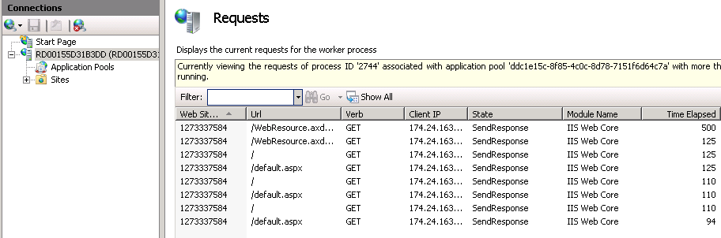

Managing IIS on Windows Azure via Remote Desktop
====================
by [Thomas Deml](https://github.com/thomasdeml)

## Introduction

Since November 2010 Windows Azure allows you to connect to your role via Remote Desktop. Managing IIS on these Windows Azure instances is most of the time not different from managing IIS on a regular Windows Server image. This article will revisit the ways IIS can be managed via Remote Desktop.

## Connecting to Windows Azure via RDP

Before you can manage IIS on a Windows Azure Instance you have to connect to the instance via RDP. Here is a link to [TBD] walkthrough that explains how to configure RDP for your Windows Azure Instances.

## Quick Primer on how to Manage IIS

IIS has many different management interfaces, for example the User Interface, the command-line and programmatic interfaces like AHAdmin, Microsoft.Web.Administration and WMI. In this walkthrough we focus on the User Interface and the command-line.

**NOTE: Do not make changes to IIS configuration when managing Windows Azure images via RDP. Changes to a Windows Azure image are not persisted and the next time an image will be started it will have lost the changes you made. Changes should only be made via the Windows Azure service configuration files or in the RoleEntryPoint::OnStart method. Go to this [link](../../manage/managing-your-configuration-settings/using-configuration-editor-generate-scripts.md "Auto-generating scripts via the IIS Configuration Editor") if you want to auto-generate IIS configuration code for the RoleEntryPoint::OnStart method.**

## Common IIS Management Tasks with INETMGR

When connecting to your Windows Azure instance you will see an INETMGR icon. By double-clicking it the IIS User Interface opens. INETMGR allows you to take a convenient and quick peak at the IIS configuration , for example to verify if changes you made in the Windows Azure service configuration file or in the RoleEntryPoint::OnStart method were successfully applied. Details on how to look at IIS configuration via the User Interface can be found in this [article](../../get-started/getting-started-with-iis/getting-started-with-the-iis-manager-in-iis-7-and-iis-8.md "Managing IIS via INETMGR").

As mentioned above it is not recommended to change configuration via the IIS User Interface. But there is also very interesting run-time data that's worth looking at in case you have to troubleshoot production issues.

##### Worker Processes

To look at he resource consumption of IIS worker processes you have to click on the machine name of your IIS server in INETMGR. Then click on the Worker Processes icon in the center of the INETMGR window. You will see a list of your worker processes and their resource consumption:

##### Currently Executing Requests

If you want to go into even more details you can look at the requests currently executing in your worker process(es). This can be of help yif ou need to find requests that take very long or do not return at all. For this you only have to select a worker process and click on "View Current Request" on the right hand side of the windows. You should see something like this:

#### Enabling Request Tracing

Another powerful way to debug your Azure web server is to enable Failed Request Tracing. Failed Request Tracing generates a detailed trace about what's going on for each request. To limit the number of traces rules can be specified which requests to trace. [Here](../../troubleshoot/using-failed-request-tracing/troubleshooting-failed-requests-using-tracing-in-iis.md "Enabling Request Tracing") is a detailed walkthrough on how to enable Failed Request Tracing.

## Common IIS Management Tasks via Command-line

There are two options if you want to manage IIS via the command-line:

1) APPCMD

2) The IIS Powershell Snap-In

#### Managing IIS via APPCMD

Managing APPCMD via command-line is easy. Just open a n elevated command shell and refer to the following [articles](../../get-started/getting-started-with-iis/getting-started-with-appcmdexe.md "Getting Started with APPCMD") available on how to manage IIS via APPCMD.

##### Looking at Run-time Data

Here are the commands for looking at run-time data:

- Worker Process Resource Consumption: %windir%\system32\inetsrv\appcmd list wp
- Currently Executing Requests: %windir%\system32\inetsrv\appcmd list requests

#### Managing IIS via the IIS Powershell Snap-in

The IIS Powershell Snap-in is only available if you are running your Windows Azure instance on an Windows Server 2008 R2 based image. If you do that you'll see a Powershell shortcut on the desktop. Double-click the short cut and refer to the following [articles](../../manage/powershell/index.md "Managing IIS with the Powershell Snap-in") on how to manage IIS with the Powershell Snap-in.

#### Looking at run-time data

How to look at worker process resource consumption, currently executing requests is described in [this article](../../manage/powershell/powershell-snap-in-run-time-data.md "Run-time data"). TUo enable Request Tracing use the Enable-WebRequestTracing cmdlet.

## Accessing Logs and Failed Request Logs

Sometimes it is necessary to look at IIS's log files to figure out what's happening on your Windows Azure instance. To make this easier you will find another two shortcuts on the Windows Azure Remote Desktop. One points you to the IIS log file directory and the other one to the Failed Request Log directory. These locations will have subdirectories starting with the instance id of the sites you are hosting. By clicking on the "Sites" node in INETMGR or by executing the APPCMD command APPCMD LIST SITES you can easily associate site names with instances .

## Summary

In this article you learned how to manage Windows Azure via Remote Desktop. You learned the basic tasks to manage IIS on these instances and how to access run-time data like currently executing requests or the log and failed request traces.