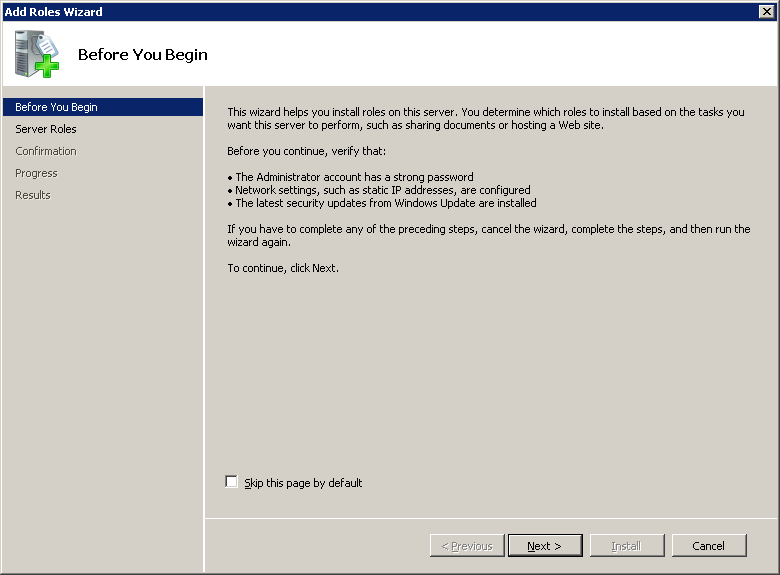

DNS Server
====================
by [Walter Oliver](https://github.com/walterov)

## Prerequisites

You must have a working Dynamic Name Services (DNS) server on the network to run Windows Deployment Services. Administrators may choose to dedicate an entire server to one role or to install multiple server roles on a single computer. For simplicity, the Dynamic Host Configuration Protocol (DHCP) and Domain Name System (DNS) roles can be installed together on one server.

## Installation Information

Domain Name System (DNS) is the name resolution protocol for TCP/IP networks, such as the Internet. A DNS server hosts the information that enables client computers to resolve memorable, alphanumeric DNS names to the IP addresses that computers use to communicate with each other. [This guide](http://technet2.microsoft.com/windowsserver2008/en/library/8e3f7e44-91dd-44c4-81cf-158cea7089021033.mspx?mfr=true "DNS Server") describes the DNS server role in the Windows Server® 2008 R2 operating system, and provides procedures for installing, configuring, and managing DNS servers in your network. The [Installing and Configuring Servers](http://technet2.microsoft.com/windowsserver2008/en/library/f0e5d191-727c-44d9-976f-1b748f3f78761033.mspx) topic covers a broad set of topics about AD integration and DNS network planning. The [Install a DNS Server](http://technet2.microsoft.com/windowsserver2008/en/library/3cf4d1b1-7a6e-4438-bf4f-22d9468c17321033.mspx?mfr=true "Install DNS") gives the steps to install it. Here is a summary:

**To install a DNS server**

1. Open Server Manager. To open Server Manager, click **Start**, and then click **Server Manager**.
2. Under **Roles Summary**, click **Add Roles**.

3. On **Before You Begin**, click **Next**.

4. On **Confirm Installation Selections**, click **Install**.

5. On **DNS Server**, click **Next**.

6. On **Installation Results**, click **Close**.

