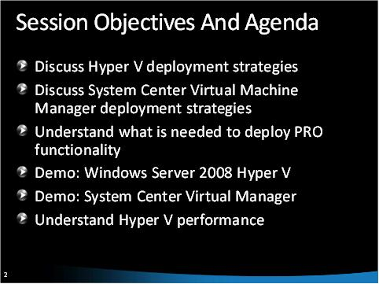

System Center Solutions (VMM &amp; SCOM)
====================
by [Walter Oliver](https://github.com/walterov)

## Introduction

System Center &lt;link: [https://www.microsoft.com/systemcenter/en/us/overview.aspx](https://www.microsoft.com/systemcenter/en/us/overview.aspx) &gt; solutions help hosting companies manage physical and virtual hosting environments across data centers. Using these integrated and automated management solutions, hosters can be more productive service providers to their customers. This article includes videos, documentation resources, and demonstrations of two key solutions from the System Center family: Virtual Machine Manager 2008 (VMM) &lt;link: [https://www.microsoft.com/systemcenter/virtualmachinemanager/en/us/default.aspx](https://www.microsoft.com/systemcenter/virtualmachinemanager/en/us/default.aspx) &gt; and Operations Manager (SCOM) &lt;link: [https://www.microsoft.com/systemcenter/operationsmanager/en/us/default.aspx](https://www.microsoft.com/systemcenter/operationsmanager/en/us/default.aspx) &gt;.

## Virtual Machine Manager Overview

This video &lt;link: [https://mediadl.microsoft.com/mediadl/IISNET/Media/HDA20-1216/Microsoft%20System%20Center%20virtual%20Machine%20Manager%202008-overview.wmv](https://mediadl.microsoft.com/mediadl/IISNET/Media/HDA20-1216/Microsoft%20System%20Center%20virtual%20Machine%20Manager%202008-overview.wmv) &gt; includes:

- Microsoft virtualization background
- System Center and virtualization
- Introduction to System Center Virtual Machine Manager
- Key features
- System Center integration
- Futures, timelines, and closing comments

This download &lt;link: "[https://download.microsoft.com/download/A/2/F/A2F199C0-672E-44E6-BF1D-878E233C3F08/SystemCenterOptimizationDemo.zip](https://download.microsoft.com/download/A/2/F/A2F199C0-672E-44E6-BF1D-878E233C3F08/SystemCenterOptimizationDemo.zip) &gt; contains a demonstration of VMM and the presentation used in this video.

For further information and guidance, see the System Center Virtual Machine Manager content on TechNet &lt;link: [https://technet.microsoft.com/scvmm/default.aspx](https://technet.microsoft.com/scvmm/default.aspx) &gt;.

## VMM Advanced Features and Best Practices

This video &lt;link: [https://mediadl.microsoft.com/mediadl/IISNET/Media/HDA20-1216/Hyper-V%20and%20SCVMM%20Deployment%20Best%20Practices.wmv](https://mediadl.microsoft.com/mediadl/IISNET/Media/HDA20-1216/Hyper-V%20and%20SCVMM%20Deployment%20Best%20Practices.wmv) &gt; provides detailed best practices for deploying Windows Server 2008 Hyper-V and System Center Virtual Machine Manager 2008.

This video &lt;link: [https://mediadl.microsoft.com/mediadl/IISNET/Media/HDA20-1216/SCVMM%20Advanced%20Features.wmv](https://mediadl.microsoft.com/mediadl/IISNET/Media/HDA20-1216/SCVMM%20Advanced%20Features.wmv) &gt; provides descriptions of the advanced features in VMM:

- Hypervisor Management –Hyper-V, VMware
- Windows Server 2008 Failover Cluster Integration
- Delegated Administration
- Performance and Resource Administration

This download &lt;link: [https://download.microsoft.com/download/A/2/F/A2F199C0-672E-44E6-BF1D-878E233C3F08/VirtualMachineManager2008.zip](https://download.microsoft.com/download/A/2/F/A2F199C0-672E-44E6-BF1D-878E233C3F08/VirtualMachineManager2008.zip)&gt; contains a demonstration of VMM and the presentations used in these videos.

## System Center Operations Manager (SCOM)

System Center Operations Manager 2007 &lt;link: [https://www.microsoft.com/systemcenter/operationsmanager/en/us/default.aspx](https://www.microsoft.com/systemcenter/operationsmanager/en/us/default.aspx) &gt; is the next step in the evolution of Microsoft operational event and performance monitoring solutions. This paper &lt;link: [https://download.microsoft.com/download/A/2/F/A2F199C0-672E-44E6-BF1D-878E233C3F08/OperationsManager%202007.zip](https://download.microsoft.com/download/A/2/F/A2F199C0-672E-44E6-BF1D-878E233C3F08/OperationsManager%202007.zip) &gt; provides an overview of the features and functionality included in System Center Operations Manager 2007.  
To get started with SCOM, visit Getting Started &lt;link: [https://technet.microsoft.com/library/bb309673.aspx](https://technet.microsoft.com/library/bb309673.aspx) &gt;, which provides information for operators and administrators using Operations Manager 2007.  
Step-by-step instructions on how to deploy SCOM are available at Deploying SCOM &lt;link: [https://technet.microsoft.com/library/bb309696.aspx](https://technet.microsoft.com/library/bb309696.aspx) &gt;.

## Conclusion

This article provides a set of videos, demonstrations, resource links, and downloads to help you learn about and deploy System Center Virtual Machine Manager (VMM) and Operations Manager (SCOM).