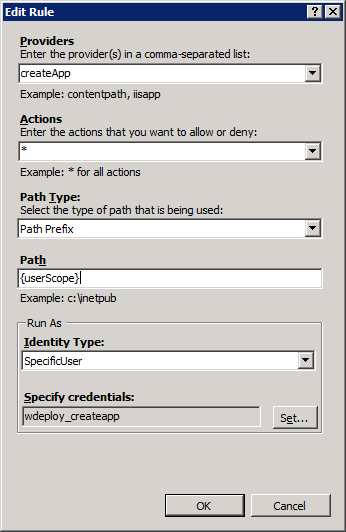

Configure Site for Web Deploy Publishing
====================
by [Bilal Aslam](https://github.com/bilalaslam)

## Configure Sites for Web Deploy Publishing

At this point, your server is configured with all the software required to support WebMatrix publishing. The Web Deploy 2.0 installer created all the necessary Management Service Delegation Rules to allow non-administrators to deploy applications and databases. It also started the Web Management Service.

Now we need to configure individual sites for Web Deploy publishing. This is similar to how you still need to enable FTP for individual sites in IIS even after you have installed FTP server features.

### *Through the IIS Manager UI*

Web Deploy's UI in IIS Manager contains a useful component for quickly configuring Web Deploy for a particular site:

1. Start IIS Manager by clicking Start &gt; Run and type "inetmgr.exe"
2. Right-click the site you want to publish to, click Deploy and then click "Configure Web Deploy Publishing…"
3. This dialog performs several useful tasks:  

    - Sets appropriate file system permissions on the site's root folder so Web Deploy publishing will work.
    - Generates a file containing Web Deploy publishing settings. This convenient file can be used in tools like WebMatrix and Visual Studio to publish to the site.  
 For now, you can just click "Setup" and copy the generated file to your development computer. If you are interested in customizing some of these options, here's an explanation of what each one of them does:  

        | Select a user to give publishing permissions | If you have an IIS Manager that has IIS Manager Permissions to the site, it will be pre-populated here. Otherwise, select a Windows or IIS Manager. This is the user account the end user will publish with. |
        | --- | --- |
        | Enter a SQL Server / MySQL connection string to be used during publishing | If you enter database connection strings here, they will be saved to the publish settings file this dialog generates. Please note that databases need to be created outside of this UI. This UI will NOT create database artifacts such as users, logins etc. for you. Use a tool like SQL Server Management Studio or mysql.exe to provision databases for your users. |
        | Specify the URL for the publishing server connection | This is the Web Deploy Management Service publishing endpoint. This value should be pre-filled. |
- Click Setup.
- Copy the .publishSettings file from your Desktop folder and to a computer running WebMatrix
- Start WebMatrix and create a new site
- Click Publish and "Import web hosting settings" and select this fileYou should now be able to publish to this site.

### *Automating through PowerShell*

Web Deploy 2.0 also contains scripts which automates the above process, plus scripts for creating SQL Server and MySQL databases. You can read more about these scripts [here](../../publish/using-web-deploy/web-deploy-powershell-cmdlets.md). We suggest that you use the SetupSiteForPublishing.ps1 script as guidance. A script solution which fully configures a site for Web Deploy must do the following:

1. Create the site with appropriate port binding, application pool, name, directory etc.
2. Grant a Windows or IIS Manager user IIS Manager Permissions to the site's scope
3. If the user in the previous step is an IIS Manager User, the Web Management Service's identity needs to have permissions to the site's root physical folder. Alternatively, if the user is a Windows user, that user account needs to have permissions on the site's root phyiscal folder.

## Next Steps

After you have all your server components installed and configured, you should try [validating your setup](validate-your-server-configuration.md "Validate your server setup").

[Discuss in IIS Forums](https://forums.iis.net/1157.aspx)