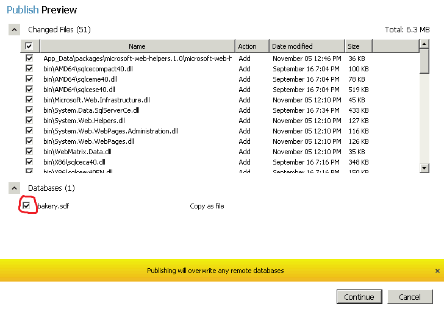
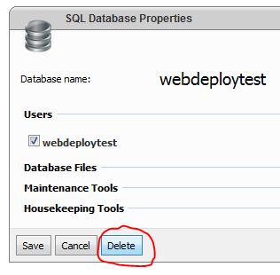
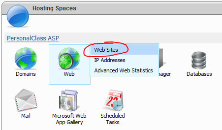
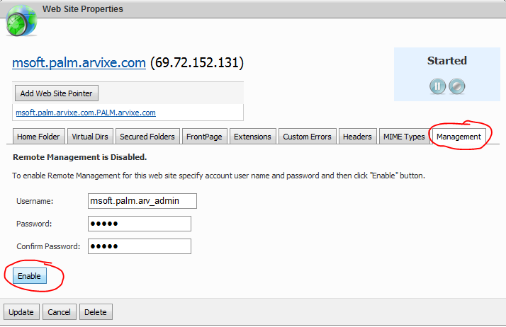
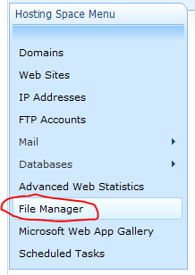

How WebMatrix Verification Works
====================
by [Simon Tan](https://github.com/simtan)

## Introduction

After you [install the required server components](install-server-components.md "Install Server Components") and have [validated your server configuration](validate-your-server-configuration.md "Validate your server configuration"), you supply a sample account to the Microsoft Web Hosting Gallery team in the form of a [Profile XML file](generate-a-profile-xml-file.md "Generate a Profile XML file") and a WebMatrix verification test suite is run from our side. The test is composed of publishing a series of web applications to the provided test account and ensuring that they run on your servers.

This document describes the testing process, so that you may also try it for yourself to catch problems early. This process is also known as "client-side validation".

## Applications Tested

The following web applications (mostly from the [Web Application Gallery](https://www.microsoft.com/web/gallery/ "Web Application Gallery")) are published to your servers in sequence:

- Bakery (from a WebMatrix site template)
- [DotNetNuke](https://www.microsoft.com/web/webmatrix/) [using SQL database]
- [WordPress](https://www.microsoft.com/web/webmatrix/)\*
- [nopCommerce](https://www.microsoft.com/web/webmatrix/)
- [Moodle](https://www.microsoft.com/web/webmatrix/)\*
- [Umbraco](https://www.microsoft.com/web/webmatrix/) (requires Full Trust, not recommended for Shared Hosting)
- [mojoPortal](https://www.microsoft.com/web/webmatrix/)
- [Gallery](https://www.microsoft.com/web/webmatrix/)\* [using MySQL database]
- [Joomla!](https://www.microsoft.com/web/webmatrix/)\*
- [Drupal](https://www.microsoft.com/web/webmatrix/)\*
- [BlogEngine.NET](https://www.microsoft.com/web/webmatrix/)
- [ResourceBlender](https://www.microsoft.com/web/webmatrix/)
- [KenticoCMS](https://www.microsoft.com/web/webmatrix/)
- [Atomsite](https://www.microsoft.com/web/webmatrix/)
- [DasBlog](https://www.microsoft.com/web/webmatrix/) (requires Full Trust, not recommended for Shared Hosting)
- [PHPBB](https://www.microsoft.com/web/webmatrix/)\* [using MySQL database]
- [SugarCRM](https://www.microsoft.com/web/webmatrix/)\*

\* These applications are built on PHP/MySQL and are **not required** to pass testing in order for you to obtain the Spotlight status on the Hosting Gallery.

## Test Process

1. **Launch WebMatrix** and click on **My Sites**. We have all of the applications above pre-installed on our test machine, but others may need to install them anew. To do so, please refer to the [app-specific documentation](https://www.microsoft.com/web/webmatrix/ "Installing and Publishing Apps with WebMatrix").  
  
      
  
 Choose one of the applications to test with.
2. Open the **Publish Settings** dialog box.  
  
    
3. Choose to **Import** a publishing settings file, and select a \*.publishsettings file that defines the test account.  
  
    
4. When prompted to use the Web Deploy or FTP protocol, choose **Web Deploy**.  
  
      
  
    **Validate** the connection. This may result in a prompt about unverified certificates, which is fine. (We accept the certificate and continue.)  
  
      
  
 If validate fails in any way, record the error and consider the publish test a failure.
5. Save and close (or Apply and Cancel) the Publish Settings dialog. Check for **Publish Compatibility** before you move on. This has the beneficial side-effect of automatically correcting the .NET App Pool version on the server.  
  
      
  
      
  
      
  
 If any of the checks fail, we still     **continue through to publishing** .
6. Click **Publish** from the Ribbon. On the Publish Preview screen, ensure that **all items are checked** – especially all **databases** whether they are just SDF files or full SQL databases.  
  
      
  
 Continue and wait for Publishing to complete.  
  
      
  
 If there are any errors during the generation of the Publish Preview or during the actual Publishing operation, record the error and consider the publish test a failure.
7. At the end of the publish operation, click the destination URL that is provided and check to see if the remote website loads in the browser.  
  
      
  
 Perform operations such as logging in and playing with things in the application (e.g. creating a blog entry). If any errors are encountered, record the error and consider the publish test a failure.  
  
      
  
 If the application works fine at this point, you have passed testing for this application.
8. Once you've finished testing an application, regardless of whether the publish test passed or failed, you need to clean up the server before attempting another publish. To do this, the control panel associated with the account must be used. The control panel should provide a way to delete databases, sites, and files. Here is the process for any hosting provider using WebsitePanel:

    - ***Resetting Databases***  
  
 The control panel should allow you to navigate to individual SQL Server or MySQL databases to delete them.  
  
          
  
          
  
          
  
 Before deleting the database, note its name. You'll need to recreate a database of the same name immediately afterwards. You'll also need to assign the same database user to it.  
  
          
  
        
    - ***Resetting the Site***  
  
 You'll need to remove the website entry off of the control panel and recreate it.  
  
          
  
          
  
          
  
 Note the name of the website for restoring later.  
  
          
  
 Recreate the site on the same domain as the one that was deleted.  
  
          
  
 Note that you'll also have to re-enable Remote Management in order to publish again.  
  
          
  
 Use the same password as the Web Deploy password in the account settings file.
    - ***Deleting Files***  
  
 The control panel should have a "File Manager" you can use to delete all the files under the site root folder.  
  
          
  
 Usually, all the files you published end up under the site folder in "wwwroot" or something similar. Delete all files underneath that node using the file manager interface.  
  
          
  
          
  
 Alternatively, you can use an FTP client like FileZilla to remotely connect to the FTP server (listing the same files) and delete all files that way. If you have IIS Remote Management access, you can also use IIS Manager to connect to the site and delete the content of the site.

That's it! That is the testing process for one application; we repeat this process for each of the applications above.

## Known Issues

- **Default document handling** - Because Web Deploy cannot assign/create entries for Default Documents, the user (and the person testing these applications) may have to go into the control panel to add these entries manually. For example, Wordpress may seem to fail but may only need "index.php" to be added to the list of Default Documents via a control panel before operating fine.
- **Application-specific bugs** - Some applications may require a trailing slash on your Destination URL to work, and some require it **not** to be there. Some applications require Full Trust on the server, while we recommend your accounts run in only Medium trust. These application bugs are not your concern; we continually work with applicaton owners to resolve these issues, with updates published regularly on the [Web Application Gallery](https://www.microsoft.com/web/gallery/ "Web Application Gallery").
  
  
[Discuss in IIS Forums](https://forums.iis.net/1157.aspx)