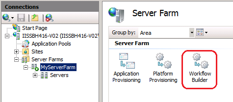
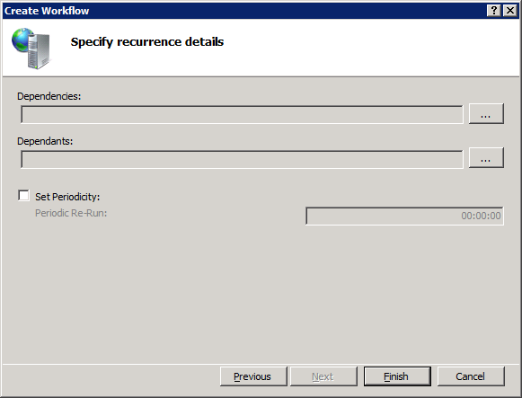

Building Workflows with Web Farm Framework 2.0 for IIS 7
====================
by Keith Newman

Web Farm Framework enables you to define and schedule custom tasks using Workflow Builder. These custom tasks can run on all servers in your web farm. Using Workflow Builder, you can define tasks (workflows) that plug into most operations within a running web farm. You can have your own custom operations that run before and/or after a Web Farm Framework operation.

This article assumes you have a functioning web farm to work with. For information about setting up a web farm, see [Setting up a Server Farm with the Web Farm Framework 2.0 for IIS 7 and Above](setting-up-a-server-farm-with-the-web-farm-framework-20-for-iis.md).

**To create a workflow provider using Workflow Builder**

1. In IIS Manager under **Connections**, click your web farm, and then click **Workflow Builder**.

    

    The **Workflow Builder** page is displayed. This page lists all workflows in the system.

    

2. Click **Add Provider. T** he **Specify workflow details** dialog is displayed.
  
      
  
   For this simple example, you will create a workflow that runs a DIR command on a server. Enter the following information in the **Specify workflog details**  dialog:  

    1. In the **Name** box, enter `DirCommand` as the workflow name.
    2. In the **Operation Scrope** box, select **Server**. The means the workflow will run on a selected server. If you select **Webfarm**, the workflow would run on the entire web farm.
    3. Leave the **Run Remote** check box selected.
    4. Leave the **Retry Attempts** and **Retry Interval** values at their default values. These values control how many attempts will be made to run the workflow and how long to wait after an unsuccessful attempt before trying again.
    5. Enter the following description: `Attempt to run a DIR command on the server.`
3. Click **Next**. The **Specify action details** dialog will appear.
  
      
  
   Enter the following information in the **Specify action details**  dialog:  

    1. In the **Type** box, select **Command**. This means the workflow action is defined using Windows shell commands. Alternatively, you could select **Powershell** to indicate you will use Powershell commands.
    2. In the **Program/Script Path** box, enter `dir {path}`. This box allows you to enter a command (as in this example) or the path to a program, a script, a batch file, or a Powershell file.
    3. Under Parameters, define a parameter with `path` as the name, System.String as the type, and a period (.) as the default value. You may also enter a description of the parameter.
4. Click **Next**. The **Specify recurrence details** dialog is displayed.  
  
      
  
   The **Specify recurrence details** dialog enables you to select **Dependencies** (other workflow providers that your new provider depends on) and **Dependants** (other providers that depend on your new provider). It also enables you to set the **Periodicity** (how often your new workflow provider will re-run).  
  
   For this simple example, none of these settings are needed.
5. Click **Finish** and the new workload provider is added to the **Workflow Builder** page.  
  
    

**To run a workflow provider using Workflow Builder**

1. In IIS Manager under **Connections**, select Servers, select and then click **Server Operations**.  
  
    
2. On the **Server Operations** page, click **Server**.  
  
    
3. Click **DirCommand** (or some other server operation you want to run), enter a value for the **path** parameter (or accept the default value), and the click **Run**.  
  
      
  
   After the command finishes, a success message appears in the box at bottom of the page.
4. **Click Close**.
5. The results of the command appear in the **Trace Messages** on the **Servers** page.  
  
    
