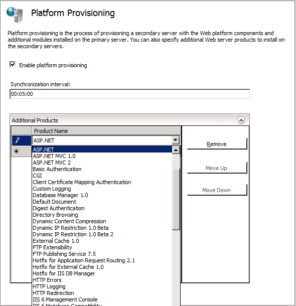

# Provisioning a Server Farm with the Web Farm Framework 2.0 for IIS 7

by Randall DuBois

You can use the Web Farm Framework 2.0 for IIS 7 and above to perform both platform and application provisioning on the servers in your server farm..

## Platform Provisioning

Platform provisioning is the process of synchronizing a secondary server with the web platform components and additional modules installed on the primary server. You can select the applications to provision, as well as the interval between synchronization cycles.

### To configure platform provisioning

1. Start **IIS Manager**, and then in the **Connections** pane, select the name of the server farm you want to configure settings for.
2. On the **Server Farm** page, double-click **Platform Provisioning**.

   

   > [!NOTE]
   > The icons for provisioning are not displayed when **Content View** is selected. If you do not see the icons, click the **Features View** tab at the bottom of the **Content** pane.

3. On the **Platform Provisioning** page, expand the **Additional Products** section.
4. To add a product to be synchronized, click twice in the **Product Name** field and then select the product you want to add. When you select a product, a new row is added.  
  
    

   The selected products will be provisioned to the secondary servers in the farm in addition to the platform components and additional applications installed on the primary server in the server farm.

5. Add the products you want, and then in the **Actions** pane, click **Apply**. You can remove products or change the order in which they are listed using the buttons to the right of the products.

## Application Provisioning

Application provisioning is similar to platform provisioning, but instead of synchronizing platform components and applications, you can specify additional Web Deploy providers to be synchronized to the servers in the farm. Application provisioning uses Microsoft Web Deploy technology. For more information see [Web Deploy](https://www.iis.net/downloads/microsoft/web-deploy).

### To configure application provisioning

1. Start **IIS Manager**, and then in the **Connections** pane, select the name of the server farm you want to configure settings for.
2. On the **Server Farm** pane, double-click **Application Provisioning**.  
  
    
  
    > [!NOTE]
    > The icons for provisioning are not displayed when **Content View** is selected. If you do not see the icons, click the **Features View** tab at the bottom of the **Content** pane.

3. In the **Application Provisioning** pane, expand the **Additional Providers** section.  
  
    
4. To add a provider to be synchronized, click twice in the **Provider** field and then select the provider you want to add.  
   When you select a provider, a new row is added.
5. Enter a path in which to install the provider on the secondary servers. This must be a file system path, such as `C:\inetpub\`. The field cannot be empty.
6. In the **Settings** field, specify the provider settings that you want to use for the selected provider. Click the field and use the browse **(…)** button to open the **Provider Settings** dialog box. For more information, see [Web Deploy Provider Settings](/previous-versions/windows/it-pro/windows-server-2008-R2-and-2008/dd569001(v=ws.10)).
7. Add the providers you want, and then in the **Actions** pane click **Apply**.
