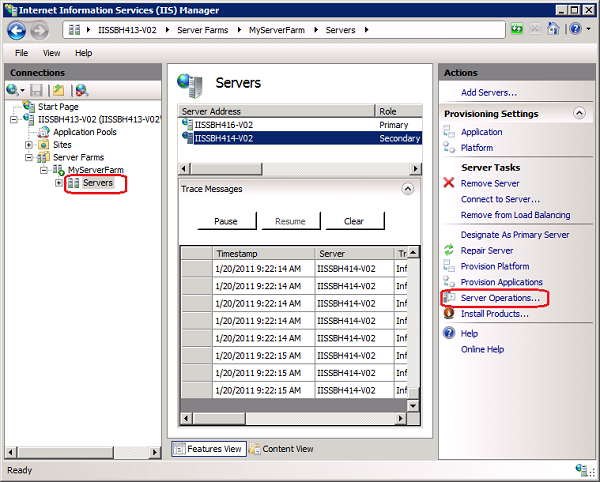

Running Server Operations Using the Web Farm Framework 2.0 for IIS 7
====================
by Randall DuBois

You can run an operation on all of the servers in the farm, or you can perform an operation on a single server.The types of operations you can perform on a server fit into the following categories:

- Server and service control. You can change the state of a service, reboot a server, or repair and reprovision a server.
- Provisioning. You can start the Web Deploy agent, query installed products, install products, provision applications, or provision the platform.
- Diagnostics and monitoring. You can get the active processes or get a list of requests.
- Server. You can test applications.

**To run server farm operations or server operations**

1. In **IIS Manager**, do one of the following:

    - To perform operations on all servers in the farm, select the name of the server farm in the **Connections** pane, and then in the **Actions** pane, click **Server Farm Operations**.   
  
        
    - To perform server operations on a specific server, select the server in the **Server** pane, and then in the **Actions** pane, click **Server Operations**.   
  
        
2. In the **Server Operations** dialog box, select the category of operation you want, and then select the operation to execute.
3. If required, provide values for the parameters for the operation.
4. Click **Run**.  
  
    

A dialog box is displayed that indicates the operation that is currently being performed. When the operation completes, the results of the operation are displayed. On the **Servers** page, you can view the operation currently running.

> [!NOTE]
> If you click **Close** in the progress dialog box, the dialog box closes, but the operation is not canceled. Operations are run when you click **Run** in the **Server Operations** dialog box.