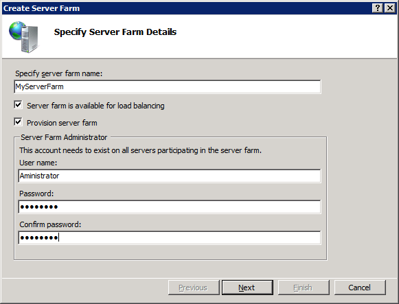
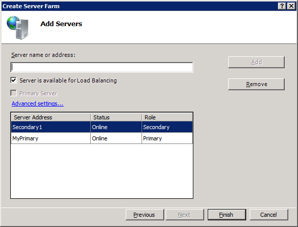
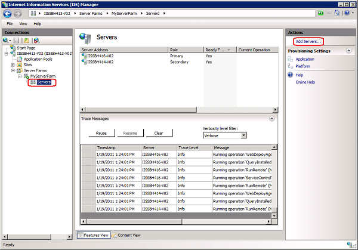
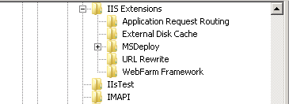

# Setting up a Server Farm with the Web Farm Framework 2.0 for IIS 7

by Randall DuBois

This article describes how to install and configure the Microsoft Web Farm Framework (WFF) 2.0 for IIS 7 and above. It covers the following:

1. How to set up and configure a primary server with the set of platform components and content that you want.
2. How to use a web farm controller server, create a server farm, and add the primary server and any secondary servers to it. This also sets up the server for load balancing using Application Request Rerouting (ARR).
3. How to specify additional web platform components and Microsoft Web Deploy providers that you want to provision and synchronize.

The article also describes how WFF automatically provisions the secondary servers and synchronizes the content from the primary server.

After you complete the steps to install and configure WFF, your server farm does not require any additional configuration or manual monitoring. Any application you install or deploy to the primary server is automatically updated on the secondary servers.

WFF uses the Microsoft Web Platform Installer (Web PI) and Web Deploy as the mechanisms to update products and applications. You can perform each of the tasks described using the UI, APIs, and Windows PowerShell cmdlets. For information about using APIs or Windows PowerShell, see [Web Farm Framework 2.0 for IIS 7 and Above Code Sample](web-farm-framework-20-for-iis-code-sample.md) or [Web Farm Framework 2.0 for IIS 7 and Above cmdlets for Windows PowerShell](web-farm-framework-20-for-iis-cmdlets-for-windows-powershell.md).

## Setting Up a Server Farm

Setting up a server farm consists of the following tasks:

- Installing the Web Farm Framework 2.0 on the controller server.
- Configuring the primary server.
- Preparing the secondary servers.
- Creating a server farm.
- Optionally, viewing status using trace messages.
- Configuring logging.

## Installing Web Farm Framework 2.0

You need to install the Web Farm Framework only on the computer that will be the Web Farm Framework *controllerserver*. The controller service installs the Web Farm Framework agent on the other servers in the server farm.

You can install Web Farm Framework 2.0 using Microsoft Web Platform Installer:

Alternatively, you can download the .msi file appropriate for your computer architecture ([x86](https://go.microsoft.com/fwlink/?LinkId=287165) or [x64](https://go.microsoft.com/fwlink/?LinkId=287166)).

> [!IMPORTANT]
> WFF requires the Web Deploy module. If you install WFF using an .msi installer, you must also install the [Web Deploy](https://www.iis.net/downloads/microsoft/web-deploy) module version 1.1 or later on the controller server.

**To install Web Farm Framework 2.0 using Web Platform Installer**

1. Install and run Web Platform Installer.
2. Select the **Products** tab, and then select **Server**.
3. Find **Web Farm Framework 2.0**, and then click Add. 
4. Click **Install**.

## Configuring the Primary Server

These steps should be performed on the computer that will be the primary server in the server farm. The components and applications installed on the primary server will be provisioned and synchronized to the secondary servers in the farm.

**To configure the primary server**

1. Download and install the [Microsoft Web Platform Installer](https://go.microsoft.com/?linkid=9739157 "Microsoft Web Platform Installer").
2. Start the Web Platform Installer and select the web platform components and applications you want to install on the primary server.
3. Follow the steps in Web Platform Installer to complete the installation of the components you selected.

## Preparing the Secondary Servers

These steps should be performed on all secondary servers that will be part of the server farm. Before attempting to add servers to a server farm, make sure the following requirements for communication are met:

- Each server that will participate in the server farm must have **one** of the following:

    - A local administrator account with the same user name and password on each server. 

        - or -
    - A domain account that is a member of the local administrators group.

> When you create a server farm, you will use this account as the server farm administrator account.

- Ensure the appropriate firewall exceptions are configured as described in the [Web Farm Framework System and Platform Requirements](system-and-platform-requirements-for-the-web-farm-framework-20-for-iis.md) article.

## Creating a Server Farm

These steps should be performed on the controller server after WFF is installed.

**To create a server farm**

1. Open **IIS Manager** and expand the nodes in the **Connections** pane. Right-click **Server Farm** and then click **Create Server Farm**. The **Create Server Farm** wizard starts.  
    

1. Enter a name for the server farm.
2. The **Server farm is available for load balancing** check box is selected by default. This creates a server farm configured for load balancing using Application Request Routing (ARR). If you do not want ARR load balancing, clear the check box.
3. Select **Provision server farm**.

> [!NOTE]
> You can enable or disable provisioning after the server farm is created. For more information, see [Provisioning a Server Farm with the Web Farm Framework for IIS 7 and Above](provisioning-a-server-farm-with-the-web-farm-framework-20-for-iis.md).

1. Enter a user name and password for the administrator account and then click **Next**.

> [!NOTE]
> The account specified must have administrator user rights to all the computers that will participate in the server farm.

1. In the **Add Servers** step, enter the server name or IP address of a server you want to add and then click **Add**.

2. - Select the **Server is available for Load Balancing** option to have the server participate in load balancing when the farm is created.
     - When you add the server you configured to be the primary server, select the **Primary Server** checkbox.  
        

3. Click **Add**. WFF attempts to connect to the specified server. If an error is displayed, it means that WFF cannot connect to the server. You can add the server to the farm anyway, or you can modify the server name or address and try again. Make sure the server you are connecting to meets the requirements listed in [Prepare the Secondary Servers](setting-up-a-server-farm-with-the-web-farm-framework-20-for-iis.md#Prepare).  
  
    

4. When you are finished adding servers to the farm, click **Finish**. WFF creates the server farm.

You can customize or define URL rewrite rules to configure load balancing. For more information, see [Using the URL Rewrite Module](../../extensions/url-rewrite-module/using-the-url-rewrite-module.md) and [Application Request Routing](https://www.iis.net/downloads/microsoft/application-request-routing).

When you create a server farm, WFF installs an agent service on each of the servers in the farm. WFF then synchronizes all of the platform components, the configuration, the applications, and content between the primary server and secondary servers. You can manage provisioning for a single server or for all servers in the farm using a single view.

## Adding or Removing Servers

You can add or remove servers in a server farm at any time. If you remove the primary server from the farm, no further provisioning will occur.

**To add a server to the farm**

1. In IIS Manager, expand the **Server Farms** node in the **Connections** pane and then expand the node for the server farm you created.
2. Select the **Servers** node in the server farm, and then click **Add Servers** in the action pane.  
  
    

> [!NOTE]
> You can also right-click the **Servers** node and then click **Add Servers**.

1. Follow the steps for adding a server in [Create a Server Farm](setting-up-a-server-farm-with-the-web-farm-framework-20-for-iis.md#Create).

**To remove a server from the farm**

1. In IIS Manager, expand the **Server Farms** node in the **Connections** pane and then expand the node for the server farm.
2. Select the **Servers** node in the server farm, and then in the content pane, right-click the name of the server you want to remove and click **Remove Server**.

For information about provisioning your server farm, see [Provisioning a Server Farm with the Web Farm Framework for IIS 7 and Above](provisioning-a-server-farm-with-the-web-farm-framework-20-for-iis.md).

## Viewing Trace Messages

Trace messages display information about the status or results of operations performed on the server farm, such as server start and stop operations, and the status of applications provisioning. The queue for trace message is limited to 1000 messages. After 1000 messages have been queued, as each new message received, a message at the beginning of the queue is removed.

Trace messages are displayed at the bottom of the **Servers** pane when you click the **Servers** node in the **Connections** pane.

When viewing trace messages, you can do the following:

- Filter messages by server, which lets you select the server you want to see messages for.
- View the role and status of the server (primary or secondary).
- View the most recent error on a server without having to look at the detailed logs.

Trace messages provide you with the following information about the servers in the server farm:

- **Timestamp** – The time the operation executed.
- **Trace Level** – The severity of the operation or error associated with the message. You can filter messages by verbosity level using the **Verbosity level** drop-down list. Trace levels include the following:

    - **Off**– Indicates whether the server is offline.
    - **Error** – Displays only errors.
    - **Warning** – Displays warning messages and error messages.
    - **Info** – Displays status or results of operations, and includes error and warning messages.
    - **Verbose** – Displays all trace messages.
- **Message** – The condition that generated the message.

## Configuring Logging

WFF logging information is generated by the service named **WebFarmService**. By default, the service provides only error information in the *WebFarmService.log* file in the *%Program Files%\IIS\Microsoft Web Farm Framework* folder. If you want to log other messages, you must add a new **DWORD** value named **EnabledTraceLevel** to the following registry key:

HKEY\_LOCAL\_MACHINE\SOFTWARE\Microsoft\IIS Extensions\WebFarm Framework

You can set the value of the **EnabledTraceLevel** key to correspond to the verbosity level filter you want to apply to logging. The verbosity level filter corresponds to the EnabledTraceLevel value as follows:

> 0 - Off  
> 1 - Error messages only  
> 2 - Warning and error messages  
> 3 - Information, warning, and error messages  
> 4 - Verbose (all messages)

