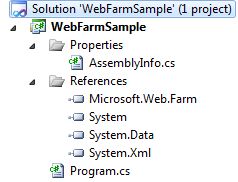

# Web Farm Framework 2.0 for IIS 7 Code Sample

by Randall DuBois

This article shows how you can develop and run an application to set up and manage the Web Farm Framework using C# or any other .NET Framework language. The example in this section shows how to use the Web Farm Framework library to create a server farm, add servers to the farm, remove servers from the farm, and then remove the server farm.

Before you begin, you must copy the appropriate version of **Microsoft.Web.Farm.dll** to your development computer. This library is installed in the GAC on all of the servers in your web farm, including the controller.

## To use the Web Farm Framework code sample

1. Copy the *Microsoft.Web.Farm.dll* to your development computer.
2. Create a Visual Studio solution.
3. Add a reference to the *Microsoft.Web.Farm.dll* assembly that you copied to your project. This enables you to add the **Microsoft.Web.Farm** namespace in your code.  
  
    
4. Copy the following code into your project:

   [!code-csharp[Main](web-farm-framework-20-for-iis-code-sample/samples/sample1.cs)]
5. Compile your project, and then run the executable on the controller server where Microsoft Web Farm Framework 2.0 is installed.