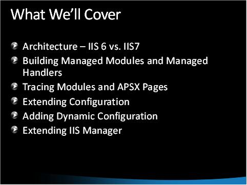

# IIS Extensibility

by [Walter Oliver](https://github.com/walterov)

## Introduction

One of the key features of IIS is its extensible modular architecture. That is, you can build and deploy your own modules and integrate them with IIS. This extensibility, along with [remote administration](../../manage/remote-administration/index.md "remote administration"), allows hosting companies to extend the out-of-the-box administration functionality. Users benefit by gaining more control over hosting services, and hosting companies can simplify administration by consolidating control panel-like functionality into the IIS Manager solution.

## Extensibility Videos

The following videos provide detailed walkthroughs of how this feature works and how to take advantage of it:

- [IIS Extensibility Part I](https://mediadl.microsoft.com/mediadl/IISNET/Media/HDA20-IIS/IIS%20Extensibility%20Part%201%20of%202.wmv "IIS Extensibility Part I")
- [IIS Extensibility Part II](https://mediadl.microsoft.com/mediadl/IISNET/Media/HDA20-IIS/IIS%20Extensibility%20Part%202%20of%202.wmv "IIS Extensibility Part II")

This [download](https://download.microsoft.com/download/A/2/F/A2F199C0-672E-44E6-BF1D-878E233C3F08/IIS7_Extensibility.zip "download") contains the presentation for these videos.

