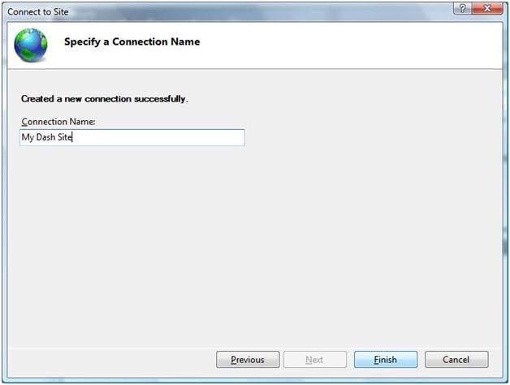

Verifying Remote Administration
====================
by [Walter Oliver](https://github.com/walterov)

## Introduction

An important characteristic of [Shared Hosting](../planning-the-web-hosting-architecture/shared-hosting-configuration.md) with IIS is that Hosters can empower their users to administer their sites remotely as described in [IIS Management and Administration](../../manage/provisioning-and-managing-iis/iis-management-and-administration.md). This article provides hosters with a set of steps to verify that the Remote Administration user experience is indeed enabled.

## User Experience Verification

### Prerequisites:

- Delegated administration must have been enabled in the server, enabling remote connections and starting the WMSVC service, see:

    - This article &lt;link: [https://www.iis.net/learn/manage/remote-administration/configuring-remote-administration-and-feature-delegation-in-iis-7](../../manage/remote-administration/configuring-remote-administration-and-feature-delegation-in-iis-7.md)&gt; provides a step-by-step guide for Configuring Remote Administration and Feature Delegation in IIS.
    - This article &lt;link: [https://www.iis.net/learn/web-hosting/web-server-for-shared-hosting/delegated-administration](../web-server-for-shared-hosting/delegated-administration.md)&gt; has a list of Feature Delegation settings relevant to Shared Hosting and instructions on how to configure them and enable remote connections (the latter is also covered in the previous bullet).
- A windows or user account with access to the user's site.
- For a Vista client the InetMgr Remote Administration must be installed. See this article &lt;link: [https://www.iis.net/learn/manage/remote-administration/remote-manager-for-windows-2003-xp-and-vista-sp1](../../manage/remote-administration/remote-manager-for-windows-2003-xp-and-vista-sp1.md)&gt;

### Steps:

1. Within a Windows Server 2008 R2, Windows 7, or Windows Vista computer run InetMgr.exe.
2. From the Connections pane select Connect to Site:  
    
3. Enter the Server and Site names and press next:  
    
4. Enter the User Credentials and press next:  
    
5. Enter a name for your Connection:  
    
6. A dialog listing the new available IIS Manager Modules should be displayed, press OK to install the new modules:  
    
7. After installation of the new modules IIS Manager will display the modules available, the example below has the Database Manager highlighted.   
    

## Conclusion

This article described the steps to verify that the Delegated Administration User Experience is enabled.