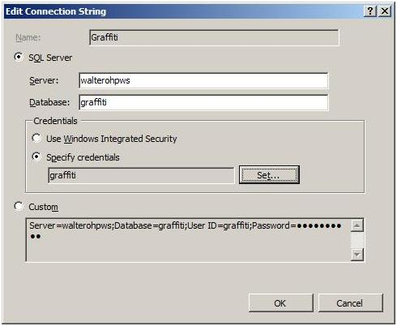
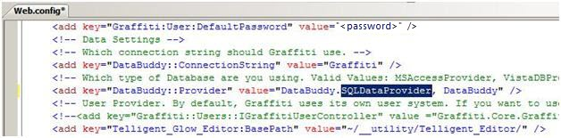
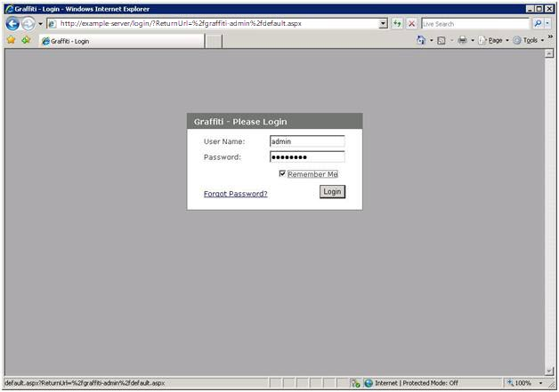
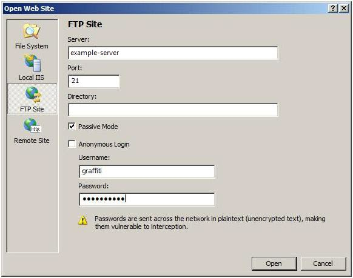
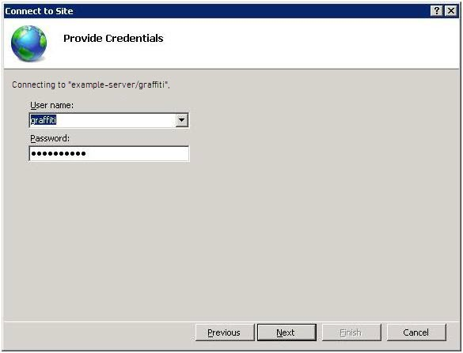

# Verifying the Developer Experience - ASP.NET

by [Walter Oliver](https://github.com/walterov)

This walkthrough is intended to help hosters verify that their customers can use the Windows Web Platform tools and services to download, customize, publish, and manage their applications in a Hosted Environment.

In this case we'll play the role of the developer and use the Microsoft Web Patform Installer to deploy a popular CMS ASP.NET application called "Graffiti CMS" in the local developer machine. Once we verify that works we'll proceed to deploy it in the hosted server.

In summary this walkthrough covers:

1. Using Web Platform Installer to install Graffiti CMS in a developer machine
2. Configuring the application to use SQL Server and test it locally
3. Using Visual Web Developer to modify and publish the application to the remote server.
4. Using IIS Manager Remote Administration feature to change the application Connection String to point to the new SQL Server.

## Prerequisites

1. The hoster must have provided the developer with credentials that have access to an FTP site that shared its content with the corresponding Web Site. See FTP and VWD articles link: [Guide to Deploy FTP and Publish with VWD](../configuring-servers-in-the-windows-web-platform/guide-to-deploy-ftp-and-publish-with-vwd.md) for details on how to setup this configuration so that users are isolated from each other.
2. The hoster must have provided the developer with a SQL Server database.
3. The developer must have installed Visual Web Developer (VWD) and SQL Server.
4. The developer must have installed the Web Platform Installer (WPI). Follow the instructions at link: <https://go.microsoft.com/fwlink/?LinkId=145510>.

## Step 1: Using WPI, install the Graffiti CMS application on your development machine

As of the writing of this article a new version of Web Platform Installer is being released to the Web. Please visit <https://go.microsoft.com/fwlink/?LinkId=145510> for more information. The set of applications include Graffiti CMS.

## Step 2: Verify the existence of the Graffiti CMS Site and corresponding Database

1. Run IISMgr and view the Sites folder in the left-hand panel.  
    
2. Run SQL Management Studio and view the Graffiti DB in the database tables:  
    
3. Use IE to browse to the site:  
    

## Step 3: Configure Graffiti to use the SQL Server Database already created

At this point you have the Graffiti application running and a SQL db created for it. However, the SQL database is not the one used by the application by default. Out-of-the box it uses its own db system (VistaDB), see connection string dialog below for the site:

The steps to setting up SQL Server are very simple:

1. Using the Graffiti database:

    - Execute the Graffiti\_SQL\_Schema.sql file found in the Data folder.
    - Execute the Graffiti\_SQL\_Data.sql file found in the Data folder.
2. Add the connection string of your database to the web.config file. It should have the name "Graffiti":  

    [!code-xml[Main](verifying-the-developer-experience-aspnet/samples/sample1.xml)]

    You can accomplish it through the Connection Strings Module in IIS Manager:

    
3. Change the AppSetting key DataBuddy::Provider value to DataBuddy.SQLDataProvider, DataBuddy in the web.config file.  
    
4. With Internet Explorer browse to the Graffiti site. Notice that since the SQL db does not render the same data that comes in the default database:  
    
5. Verify that the Application Admin credentials work the temporary password for the admin user can be found in the web.confg file:  
    
6. Enter the credentials and press Login:  
    
7. The Admin Control Panel page is display:  
    

Now you are ready to publish the application.

## Step 4: Use Visual Web Developer (VWD) to Modify and Publish Your Application

1. Open your Graffiti Site with VWD. The following dialog will display, press Yes to upgrade the site to .NET Framework version 3.5.  
      
    
2. Open the menu Website and select "Copy Web Site":  
    
3. Select FTP Site and enter the Server name, Port and user account credentials. Ensure that "Passive Mode" is checked and press Open:  
    
4. Publish the entire content to the target server.  
    

## Step 5: Use IIS Manager Remote Administration to change the Graffiti Site Connection String to point to the new SQL server.

1. Start IISMgr, if you are running Vista ensure that you are running the remote version of IISMgr:  
    
2. Connect to the Remote Site:  
    
3. Enter the Hoster provided user credentials:  
    
4. Assign a name to the new connection:  
    
5. Install any IIS Manager extension modules that are offered in the following dialog:  
    
6. Select your new Graffiti site, find the Connection String icon and double click on it:  
    
7. Change the Server Name to the new target SQL Server  
    
8. To upload the database you can use the facilities provided by the hoster. Either through database backup and restore process through FTPor any other control panel facility that would let you run the Graffiti\_SQL\_Schema.sql and Graffiti\_SQL\_Data.sql files.
9. Test that the application works in the new hosting environment. Here is a screen shot after creating a post as the Admin user:  
    

## Conclusion

This walkthrough covered:

1. Using Web Application Installer to install Graffiti CMS in a developer machine
2. Configuring the application to use SQL Server and test it locally
3. Using Visual Web Developer to modify and publish the application to the remote server.
4. Using IIS Manager Remote Administration feature to change the application Connection String to point to the new SQL Server.
