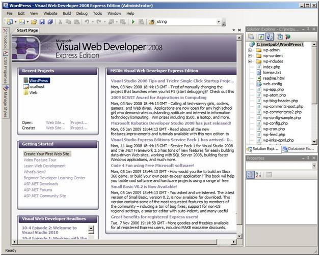
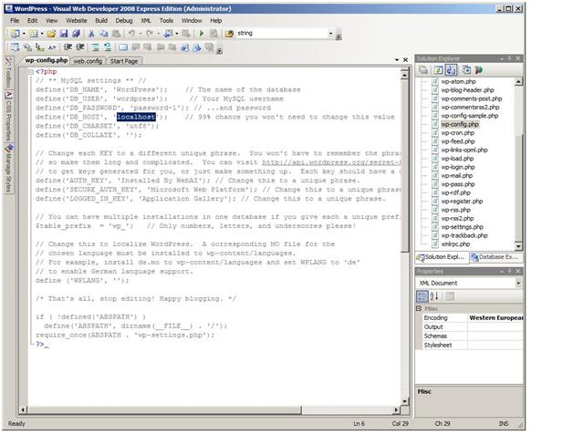
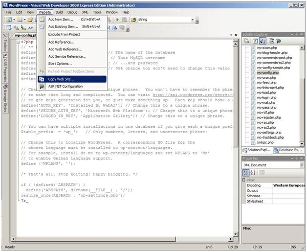

Verifying the Developer Experience - PHP
====================
by [Walter Oliver](https://github.com/walterov)

## Introduction

This walkthrough is intended to help hosters verify that their customers can use the Windows Web Platform tools and services to download, customize, publish, and manage their applications in a Hosted Environment.

In this case we'll play the role of the developer and use the Microsoft Web Platform Installer to deploy a popular blogging PHP application called "WordPress" in the local developer machine. Once we verify that works we'll proceed to deploy it in the hosted server.

In summary this walkthrough covers:

1. Using Web Application Installer to install WordPress in a developer machine
2. Configuring the application to use MySQL and test it locally
3. Using Visual Web Developer to modify and publish the application to the remote server.
4. Using IIS Manager Remote Administration feature to change the application Default document list.

## Prerequisites

1. The hoster must have provided the developer with credentials that have access to an FTP site that shared its content with the corresponding Web Site. See FTP and VWD article &lt;link: to FTP and VWD article&gt; for details on how to setup this configuration so that users are isolated from each other.
2. The hoster must have PHP installed &lt;link: [https://www.iis.net/learn/application-frameworks/install-and-configure-php-applications-on-iis/using-fastcgi-to-host-php-applications-on-iis](../../application-frameworks/install-and-configure-php-applications-on-iis/using-fastcgi-to-host-php-applications-on-iis.md)&gt;.
3. The hoster must have provided the developer with a MySQL database &lt;link: [https://www.iis.net/learn/application-frameworks/install-and-configure-php-on-iis/install-and-configure-mysql-for-php-applications-on-iis-7-and-above](../../application-frameworks/install-and-configure-php-on-iis/install-and-configure-mysql-for-php-applications-on-iis-7-and-above.md)&gt;.
4. The developer must have installed Visual Web Developer (VWD) and MySQL.
5. The developer must have installed the Web Platform Installer (WPI). Follow the instructions at &lt;link: [https://go.microsoft.com/fwlink/?LinkId=145510](https://go.microsoft.com/fwlink/?LinkId=145510) &gt;

## Step 1: Using WPI, install the WordPress application on your development machine

As of the writing of this article a new version of Web Platform Installer is being released to the Web. Please visit [https://go.microsoft.com/fwlink/?LinkId=145510](https://go.microsoft.com/fwlink/?LinkId=145510) for more information. The set of applications include WordPress.

## Step 2: Test the local WordPress Site and corresponding Database:

Use IE to browse to the site:

Now you are ready to publish the application.

## Step 3: Use Visual Web Developer (VWD) to Modify and Publish Your Application

1. Open your WordPress Site with VWD. The following dialog will display, press Yes.  
   
     
     
2. Modify the server name for the database and any other values provided by the hoster.  
     
3. Open the menu Website and select "Copy Web Site":  
   
     
     
4. Click Connect. Select FTP Site and enter the Server name, Port and user account credentials. Ensure that "Passive Mode" is checked and press Open:  
   
    
5. Proceed to publish the entire content to the target server.

## Step 4: Deploy the WordPress MySQL Database Schema and Test Site.

When WordPress runs for a first time it checks to see if the database schema is present, if it is not, it will allow the admin user to generate it.

1. Using Internet Explorer browse to the new site, the following screen is displayed, enter the information requested:  
   
    
2. WordPress will auto-generate a random password for the admin user, make note of it and proceed to login:  
     
3. Enter the Admin credentials obtain in the previous step:  
   
    
4. Now you can browse to the wp-admin page:  
     

## Step 5: Use IIS Manager Remote Administration to change the WordPress Site Default Document List.

1. Start IISMgr, if you are running Vista ensure that you are running the remote version of IISMgr:  
   
    
2. Connect to the Remote Site:  
   
    
3. Enter the Hoster provided user credentials:  
   
    
4. Assign a name to the new connection:  
   
    
5. Install any IIS Manager extension modules that are offered in the following dialog:  
   
    
6. Select your new WordPress site, find the Default Document icon and double click on it:  
   
    
7. Select the index.php default document and move it up to the first place in the list. This will improve the performance.  
   
    
8. WordPress deployment is complete.

## Conclusion

This walkthrough covered:

1. Using Web Application Installer to install the WordPress PHP application in a developer machine.
2. Configuring the application to use MySQL and test it locally.
3. Using Visual Web Developer to modify and publish the application to the remote server.
4. Using IIS Manager Remote Administration feature to change the list of Default Documents for the site.
