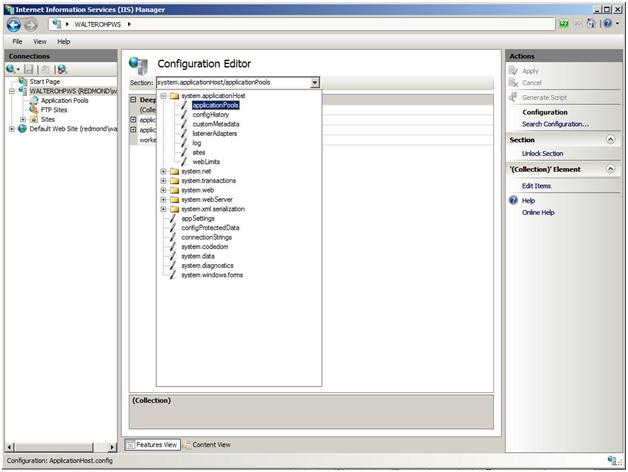
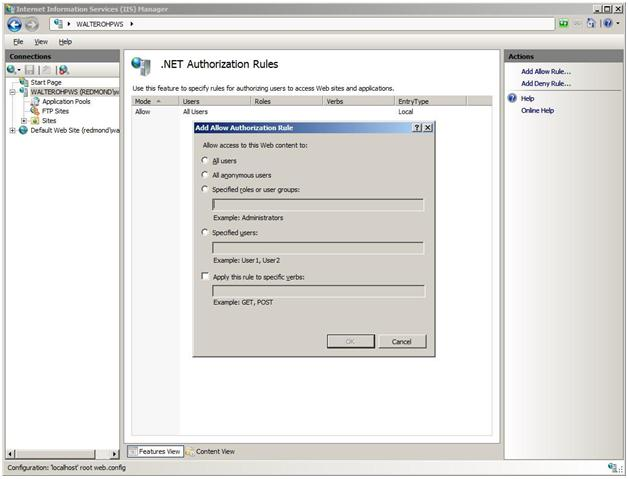

Administration Pack
====================
by [Walter Oliver](https://github.com/walterov)

## Introduction

The Administration Pack provides hosters and their customers with a set of IIS Manager modules that will help them to do the following:

- Edit server configuration settings (administrators only).
- Manage FastCGI settings.
- Manage ASP.NET authorization.
- Manage custom errors.
- Edit HTTP request filtering rules.

The purpose of this article is to provide hosters with the information that they need to learn about how to deploy the Administration Pack in hosting environments. The following image highlights the new module icons found in IIS Manager after installing the Administration Pack.

## Deploy the Administration Pack

When deploying the Administration Pack in shared hosting environments &lt;link: to shared hosting config article&gt;, it must be installed on each Web server in the farm. When using prebuilt images, the Administration Pack should be part of the image used to build up the farm servers. Follow the instructions described in [this article](https://www.iis.net/downloads/microsoft/administration-pack) to download and install the Administration Pack.

## Learn about the Administration Pack

### Configuration Editor

The Configuration Editor module will help you manage your configuration files. This tool is available for server administrators only. It allows you to edit any section, attribute, element, or collection in your configuration file, including IIS configuration settings such as the system.webServer, or ASP.NET settings such as system.web. In addition to editing these values, you can lock and unlock them. The Configuration Editor also allows you to generate scripts based on the actions you take, as well as search the file to see where values are being used.

  
   
When you enter values for a setting, Configuration Editor validates the data type to ensure that it is compatible. In the case of specific value options such as Boolean (True/False) or enumerations, a combo box is used to present only the available options. The Configuration Editor also allows you to generate scripts based on the actions you take, as well as search the file to see where values are being used. The following video &lt;link: [https://blogs.msdn.com/carlosag/archive/2008/03/31/IISAdminPackConfigurationEditor.aspx](https://blogs.msdn.com/carlosag/archive/2008/03/31/IISAdminPackConfigurationEditor.aspx) &gt; provides demonstrations of the various features of Configuration Editor:

- Schema-driven — Configuration Editor is driven entirely by the configuration schema that is found in \windows\system32\inetsrv\config\schema\. This means that if you extend the configuration system that creates your sections, they will be available for managing inside the Configuration Editor. There is no need to build an additional UI for these sections.
- Additional information — Configuration Editor exposes information, such as the location where the section is being used, where a particular element in a collection is inherited from, etc.
- Script generation — Configuration Editor allows you to make changes and generates the code to automate tasks. Configuration Editor generates managed code by using Microsoft.Web.Administration, JavaScript by using AHADMIN, or Command Line by using the AppCmd.exe tool.
- Searching — Configuration Editor allows you to quickly perform scoped searches of the configuration system for all sections and where they are being used. This makes it useful to reveal a bigger picture of the server, to prevent configuration locking violations, and for many other search functions.
- Locking — Configuration Editor lets you do advance locking, such as locking specific attributes so that they cannot be used in deeper locations, locking individual items in a collection, or locking an entire section.

#### Using the Configuration Editor

#### Script Generation

This article &lt;link: [https://www.iis.net/learn/manage/managing-your-configuration-settings/using-configuration-editor-generate-scripts](../../manage/managing-your-configuration-settings/using-configuration-editor-generate-scripts.md)&gt; explains how to take advantage of the Configuration Editor to generate scripts to help automate configuration tasks. There are three script types supported: C#, Jscript, and the AppCmd.exe tool.

#### Configuration Collections

Some IIS configuration settings come in the form of a collection. This article &lt;link: [https://www.iis.net/learn/manage/managing-your-configuration-settings/editing-collections-with-configuration-editor](../../manage/managing-your-configuration-settings/editing-collections-with-configuration-editor.md) &gt; explains how to edit the output caching profiles collection. This article &lt;link: [https://www.iis.net/learn/manage/managing-your-configuration-settings/editing-collections-using-configuration-editor-complex-sections](../../manage/managing-your-configuration-settings/editing-collections-using-configuration-editor-complex-sections.md)&gt; shows how to add a new failed request tracing rule for an .aspx request that returns a status code of 401, or takes more than a minute to respond, or returns this status code and responds after a minute.

### FastCGI Settings

The FastCGI module lets you configure FastCGI settings that are used by Web sites on the server. It lets the user add and remove FastCGI applications and change these settings. The following image depicts the Add FastCGI Application dialog box.

  
   
For a complete guide about hosting PHP applications with FastCGI, see this article &lt;link: [https://learn.iis.net/page.aspx/246/using-fastcgi-to-host-php-applications-on-iis-70/#Install\_Administration\_Pack\_for\_IIS\_7.0](https://www.iis.net/learn/application-frameworks/install-and-configure-php-applications-on-iis/using-fastcgi-to-host-php-applications-on-iis#Install_Administration_Pack_for_IIS_7.0) &gt;.

### .NET Authorization Rules Module

The .NET Authorization Rules module is one of two ASP.NET modules in the Administration Pack. By using this module, the site administrator can specify rules for authorizing users to access Web sites and applications. Specifically, the .NET Authorization Rules module provides a graphical user interface for the creation of Allow and Deny rules to manage user access to Web content. The following image depicts the Add Allow Authorization Rule dialog box.

  
   
For instructions about how to lock ASP.NET Authorization Rules, see this guide &lt;link: [https://msdn.microsoft.com/library/ms178693.aspx](https://msdn.microsoft.com/library/ms178693.aspx) &gt;.

This article &lt;link: [https://learn.iis.net/page.aspx/142/understanding-iis-7-url-authorization/#Differences](https://www.iis.net/learn/manage/configuring-security/understanding-iis-url-authorization#Differences)&gt; explains the differences between ASP.NET URL Authorization and IIS URL Authorization.

### .NET Error Pages

The .NET Error Pages provide a graphical user interface for configuring HTTP error responses. They enable the configuration of custom error pages and default settings. The image below depicts the Add Custom Error Page dialog box.

### HTTP Request Filtering

The HTTP Request Filtering module is a gatekeeper component that protects the Web server from malicious requests. Filtering rules include:

- Block or unblock requests for files with particular file name extensions.
- Add or remove configuration segments to the "Hidden Segments" list.
- Add or remove specific URL sequences to the "Deny URL Sequence" list.
- Block or unblock HTTP verbs.
- Add headers with specific size limit.

When IIS 7.0 was released as part of Windows Server 2008, it included this feature but it did not include the IIS Manager module that could be used to manage this feature. Thus, no graphical user interface was available to facilitate the request filtering configuration. For examples of using request filtering by simply adding new configuration to the Web.config file, see this article &lt;link: [https://learn.iis.net/page.aspx/143/how-to-use-request-filtering/](https://www.iis.net/learn/manage/configuring-security/use-request-filtering) &gt;.

This blog post &lt;link: [https://blogs.iis.net/bills/archive/2008/03/23/how-to-un-block-directories-with-iis7-web-config.aspx](https://blogs.iis.net/bills/archive/2008/03/23/how-to-un-block-directories-with-iis7-web-config.aspx) &gt; shows how you can use request filtering to block or unblock access to sections of a site. This blog post &lt;link: [https://blogs.msdn.com/carlosag/archive/2008/03/24/IISAdminPackRequestFiltering.aspx](https://blogs.msdn.com/carlosag/archive/2008/03/24/IISAdminPackRequestFiltering.aspx) &gt; accomplishes the same task using the IIS Manager module included in the Administration Pack.

The following sections describe the latest features of HTTP Request Filtering.

#### Creating rules to disallow string patterns in parts of requests

This new feature enables you to create a rule list. You can specify rules to reject requests based on patterns that are matched against certain parts of an HTTP request. The main configuration for this feature is the filteringRules section under the system.webServer/security/requestFiltering section in the ApplicationHost.config file or in the Web.config file. If a request is rejected because of this rule, HTTP status 404.19 is logged in the IIS log.

#### Creating a safe list for URLs or query strings

This new feature lets you specify safe URLs or query strings that can bypass all of the defined deny rules. For example, you can always allow the URL "/my.login.page.asp," even though this URL may trigger a defined deny rule. The basic configuration for this feature include the alwaysAllowedUrls attribute and the alwaysAllowedQueryStrings attribute. These attributes are located under the system.webServer/security/requestFiltering section in the ApplicationHost.config file or in the Web.config file.

#### Creating a deny list of query strings

The most common SQL injection attacks are performed by manipulating query strings. This new feature enables you to filter malicious requests by inspecting query strings.

To deny a list of URL sequences for all requests, create a denyQueryStringSequences section in the ApplicationHost.config file or in the Web.config file, and then add the list of strings that you want to disallow in the URLs of your requests. If a request is rejected because of this rule, HTTP status 404.18 is logged in the IIS log.

#### Checking for both escaped and unescaped query strings

This new feature enables you to scan for both escaped query strings and unescaped query strings by using the unescapeQueryString attribute under the system.webServer/security/requestFiltering section in the ApplicationHost.config file or in the Web.config file. If a request is rejected because of this rule, HTTP status 404.18 is logged in the IIS log.

The following image depicts the list of blocked file name extensions:

  
   
Notice that HTTP Request Filtering is designed and optimized for security scenarios only, while URL Rewrite &lt;link: [https://learn.iis.net/page.aspx/531/url-rewrite-for-hosters/](https://www.iis.net/learn/web-hosting/web-server-for-shared-hosting/url-rewrite-for-hosting-providers)&gt; can be applied for a broader set of scenarios; security scenarios are a subset of these. For more details about the differences between these two modules, see this article &lt;link: [https://learn.iis.net/page.aspx/501/iis-70-request-filtering-and-url-rewriting/](https://www.iis.net/learn/extensions/url-rewrite-module/iis-request-filtering-and-url-rewriting) &gt;.

## Conclusion

This article provided an overview of the Administration Pack and a map to resources available for hosters to deploy and configure it in shared hosting environments.
