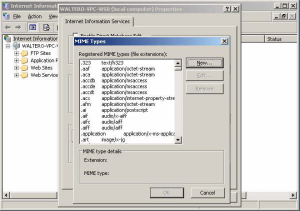
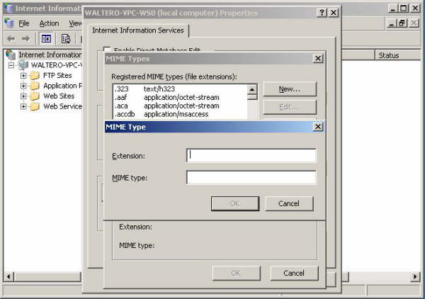

# Configuring IIS for Silverlight Applications

by [Walter Oliver](https://github.com/walterov)

## Introduction

Microsoft SilverlightTM is a cross-browser, cross-platform plug-in for delivering the next generation of .NET-based media experiences and rich interactive applications for the Web. Silverlight offers a flexible programming model that supports AJAX, VB, C#, Python, and Ruby, and integrates with existing Web applications. Silverlight supports fast, cost-effective delivery of high-quality video to all major browsers running on the Mac OS or Windows.

In most cases, hosters do not need to perform particular deployments to support Silverlight. However, check for the following basic items that could prevent Silverlight from functioning correctly.

## MIME Types

### IIS in Windows Server 2008

All MIME types needed to support Silverlight are implemented by default in IIS 7 and above in Windows Server 2008 and Windows Vista SP1. Windows Vista customers can add MIME types by running IIS Manager, clicking **MIME Types**, then clicking **Add,** and then adding the following MIME types:

- .xap application/x-silverlight-app
- .xaml application/xaml+xml
- .xbap application/x-ms-xbap

Alternatively, you can add the following MIME types to your %*windir*%\system32\inetsrv\config\applicationHost.config file in the &lt;staticContent&gt; section.

[!code-xml[Main](configuring-iis-for-silverlight-applications/samples/sample1.xml)]

### In Windows Server 2003 IIS 6.0

To enable IIS 6.0 in Windows Server 2003 or IIS 7 in Windows Vista with the appropriate MIME Types, add:

- .xap application/x-silverlight-app
- .xaml application/xaml+xml
- .xbap application/x-ms-xbap

Here is a VBS script you could run to enable each of these types:

[!code-vb[Main](configuring-iis-for-silverlight-applications/samples/sample2.vb)]

If you copy and paste the code above into a VBS file and save it as ADDMIMETYPE.VBS, the syntax to add each type would be:

[!code-console[Main](configuring-iis-for-silverlight-applications/samples/sample3.cmd)]

[!code-console[Main](configuring-iis-for-silverlight-applications/samples/sample4.cmd)]

[!code-console[Main](configuring-iis-for-silverlight-applications/samples/sample5.cmd)]

### Using the IIS Manager User Interface in IIS 6.0 in Windows Server 2003

1. Go to Start\Administrative Tools and run IIS Manager. See the figure below:  
    
2. Right click on the server name and select **Properties.** See the figure below:  
    
3. In the **Properties** dialog box, click **MIME Types.** See the figure below:  
    
4. In the **MIME Types** dialog box, click **New.** See the figure below:  
    
5. In the **MIME Types** dialog box, enter one of these MIME types:  

   - .xap application/x-silverlight-app
   - .xaml application/xaml+xml
   - .xbap application/x-ms-xbap

     See the figure below:

     

For detailed information on Silverlight, visit [http://silverlight.net/](http://silverlight.net/).
